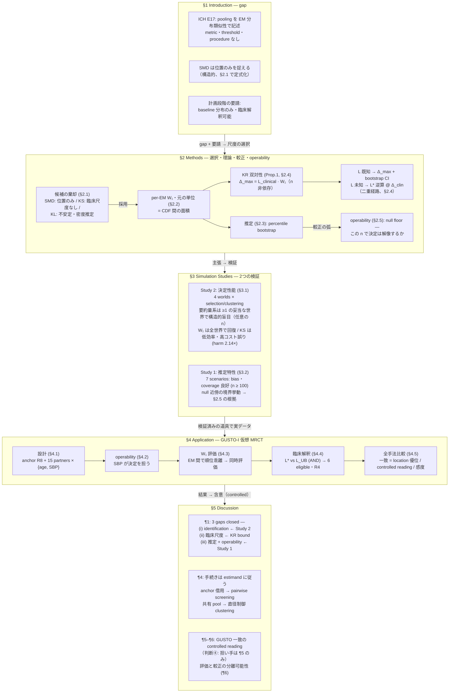

# PAPER_LOGIC — per-EM W₁ paper argument map

**Date**: 2026-09-06（旧 `paper_logic_ja.drawio` / `paper_logic_ja.html` は `archive/` へ — 本書が後継）
**Manuscript**: `paper/per_em_W1_wiley.tex`（23 pp、本文 TODO 0、abstract は Terminal pass 待ち）

> ⚠ **節番号の正（compiled numbering, `.aux` 確認 2026-09-06）**:
> operability は **§2.5**（内部記録の「§2.6」は旧構成の呼称）。SMD の位置限定の定式化は **§2.1**。
> §2.1 existing / §2.2 W₁ / §2.3 estimation / §2.4 calibration / §2.5 operability / §3.1 Study 2 / §3.2 Study 1 / §4.1–4.5 / §5。

## 論理構造（縦 = 論証の流れ）

## 主張 ↔ 証拠の台帳（Discussion ¶1）

| 主張 | 内容 | 証拠の所在 |
|---|---|---|
| (i) identification | 要約量ベースの競合は少なくとも1つの臨床的に妥当な世界で構造的に盲目（任意の n）。W₁ は盲目でない | §3.1（gate: `R/verify_study2_figures.R` ALL PASS） |
| (ii) 臨床尺度 | Δ_max = L·W₁ が分布距離を臨床スケールへ翻訳（KS/RV には無い性質） | §2.4 Prop.1（KR 双対性、n 非依存） |
| (iii) 推定可能性 | percentile bootstrap が n≥100 で良好、null 近傍は operability が計画基準化 | §3.2 + §2.5 + §4.2 |

## 3つの最上位の問い

| 問い | 答える場所 |
|---|---|
| Q_metric — どの尺度か | §2.1–2.2（構造）+ §3.1（決定性能）+ §4.5（実データの controlled reading） |
| Q_calibration — 臨床的に何を意味するか | §2.4（二重経路）+ §4.4（L*/L_UB 判定） |
| Q_operability — その n で決定は解像するか | §2.5（null floor）+ §3.2（境界挙動）+ §4.2（GUSTO 診断） |

## 統治ルール（執筆上の不変条件）

- **判断④**: GUSTO 一致は Discussion ¶5 のみが担う。abstract には載せない
- **scope**: 論文の主張は Q_metric = 「W₁ は盲目でない」(identification)。効果追跡 sim は行わない
- **RV2/RV3 は我々の拡張** — 「小宮山の手法」と呼ばない（RV1 のみが as written）
- **abstract**: SIM 規定 250 words、Terminal pass で処理（B/C 草案は outline §0-bis）
