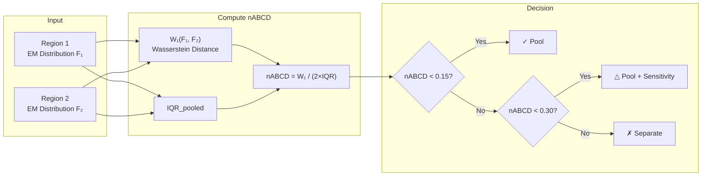
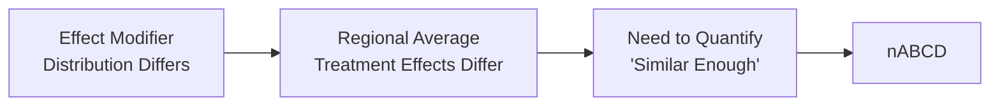

# Figure 1: Conceptual Diagram - Effect Modification and Regional Heterogeneity

**Author**: Katrina Bennett
**Date**: 2026-02-05

---

## Mermaid Diagram

```mermaid
flowchart TB
    subgraph DRUG["Same Drug Mechanism"]
        D[Treatment Effect<br/>τ(x) depends on x]
    end

    subgraph REGA["Region A"]
        direction TB
        A1["Patient Distribution<br/>Younger, Lower BMI"]
        A2["Average Effect: τ̄_A = ∫τ(x)dF_A(x)"]
        A1 --> A2
    end

    subgraph REGB["Region B"]
        direction TB
        B1["Patient Distribution<br/>Older, Higher BMI"]
        B2["Average Effect: τ̄_B = ∫τ(x)dF_B(x)"]
        B1 --> B2
    end

    D --> A1
    D --> B1

    A2 --> RESULT["Different Observed Effects<br/>τ̄_A ≠ τ̄_B"]
    B2 --> RESULT

    RESULT --> QUESTION{"Are distributions<br/>similar enough?"}

    QUESTION -->|"nABCD < 0.15"| POOL["Pool Regions"]
    QUESTION -->|"nABCD > 0.30"| SEPARATE["Separate Analysis"]
```

---

## Alternative: Decision Flow



---

## Simple Version for Paper



---

## Render Instructions

To render Mermaid diagrams:

1. **VS Code**: Install "Markdown Preview Mermaid Support" extension
2. **GitHub**: Mermaid is natively supported in markdown
3. **Export to PNG**: Use mermaid-cli (`mmdc` command)
   ```bash
   npm install -g @mermaid-js/mermaid-cli
   mmdc -i fig1_concept.md -o fig1_concept.png
   ```
4. **Online**: Use https://mermaid.live/

---

*Figure 1 concept diagram by Katrina Bennett | 2026-02-05*
