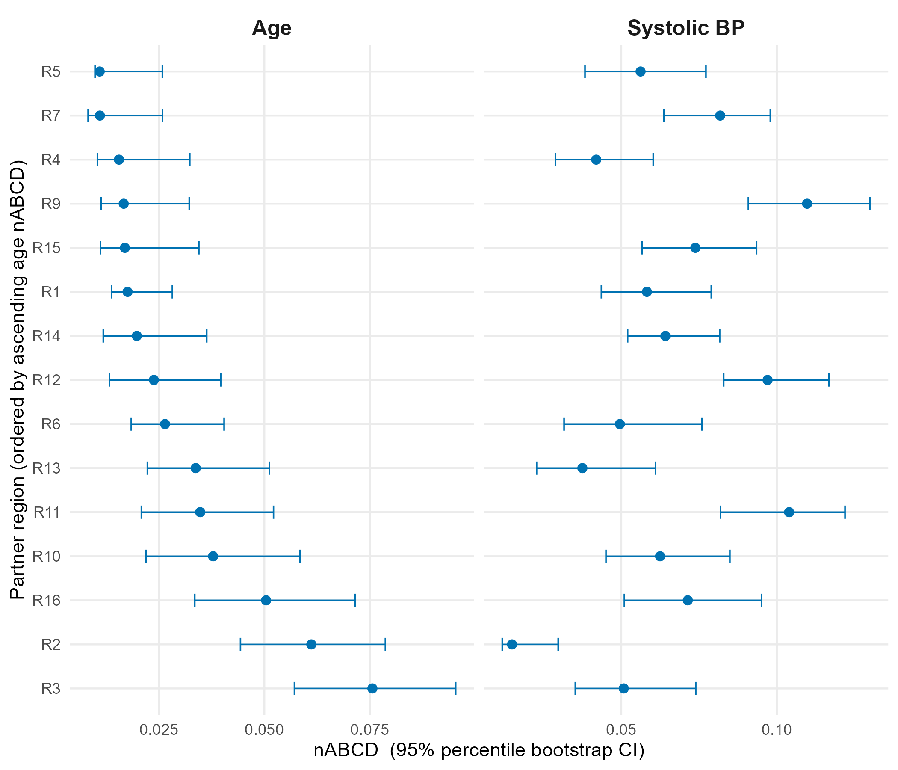
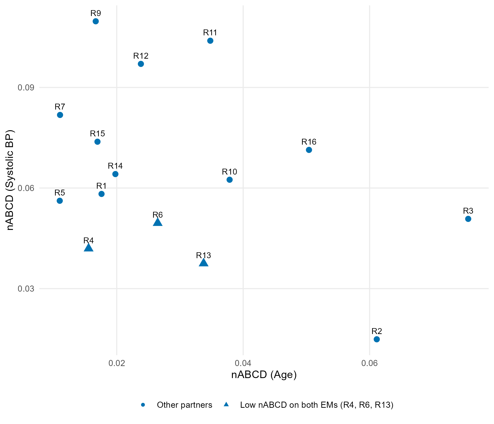
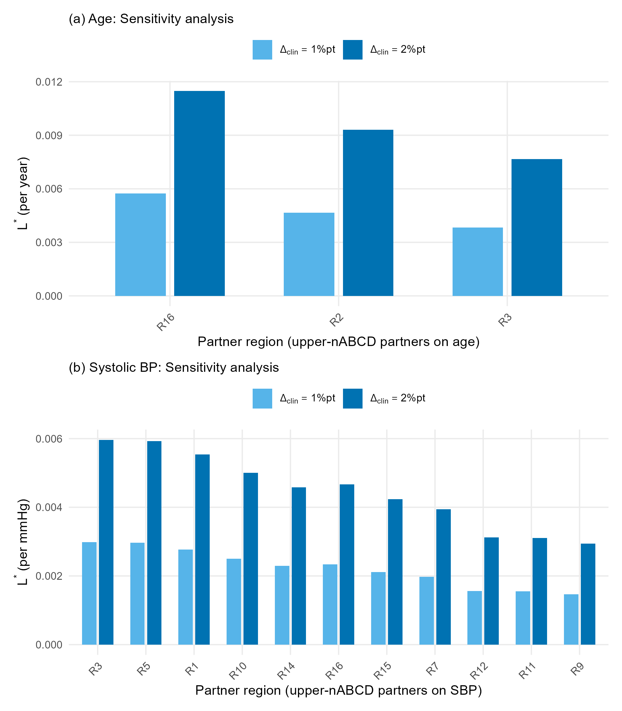

# 多地域臨床試験における地域プーリングのための効果修飾因子類似性の定量化

**Quantifying Effect Modifier Similarity for Regional Pooling in Multi-Regional Clinical Trials**

---

## 要旨（Abstract）

ICH E17ガイドラインは、多地域臨床試験（MRCT）における地域プーリングを効果修飾因子（EM）分布の類似性に関連付けて記述しているが、そのような類似性を定量化する具体的な方法論は示されていない。本論文では、計画段階の非類似度指標として**正規化累積分布間面積**（normalized Area Between Cumulative Distributions; nABCD）を提案する。nABCDは、2つの分布間のWasserstein-1距離をプール四分位範囲（IQR）の2倍で除したものとして定義される。標準化平均差（SMD）とは異なり、nABCDは位置に加えてスケールおよび歪度の差を捕捉する——非線形の効果修飾を通じて治療効果異質性を駆動しうる分布的特徴である。nABCDはベースラインEM分布のみを必要とするため、過去の試験、疾患レジストリ、リアルワールドエビデンス（RWE）データベースなど任意の代表的データソースから算出可能であり、小標本地域が試験開始前にプーリング相手候補を同定するという典型的な計画シナリオを支援する。さらに**双経路の臨床較正**を整備した：条件付き平均治療効果（CATE）感度（$L$）に関する事前エビデンスが利用可能な場合、nABCDをブートストラップ信頼区間付きで地域間の最大潜在的治療効果差（$\Delta_{\max}$）に翻訳する；$L$ が未知の場合、事前指定された臨床マージンにおいて要求されるCATE感度（$L^*$）を逆算する枠組みを与える。7つの体系的シナリオにわたるシミュレーション研究は、地域あたり中程度のサンプルサイズにおいて、無視できない分布差に対するパーセンタイルブートストラップ推定量の十分なバイアスおよびカバレッジを実証した。本フレームワークは、公開GUSTO-I個別患者データに基づく仮想的血栓溶解薬MRCTを通じて例示する：1地域を小標本のアンカーとして指定し、残る地域を2つの候補効果修飾因子（年齢および収縮期血圧[SBP]）についてプーリング相手として評価した。相手のランキングは2つの効果修飾因子間で著しく異なり、一方では類似でも他方では非類似と判定される地域が複数存在し、すべての候補効果修飾因子を**結合的に**評価する必要性を実証した。少数の地域は両方の候補効果修飾因子で低ランクであり、かつ意味のある治療効果差を生じるためには臨床的に妥当性の低いCATE感度を要することから、有力なプーリング候補として浮上した。本研究の主要な貢献は、これまで「十分に類似している」という質的判断であったものを再現可能な定量的根拠に変換することにより、ICH E17実装における方法論的ギャップを埋め、任意の代表的集団データソースに基づくエビデンスに基づく地域プーリング判断を支援する点にある。

**キーワード**: 多地域臨床試験、ICH E17、効果修飾因子、Wasserstein距離、地域プーリング、分布類似性

---

## 略語一覧

| 略語 | 英語 | 日本語 |
|------|------|--------|
| ABCD | Area Between Cumulative Distributions | 累積分布間面積 |
| AMI | Acute Myocardial Infarction | 急性心筋梗塞 |
| CATE | Conditional Average Treatment Effect | 条件付き平均治療効果 |
| CDF | Cumulative Distribution Function | 累積分布関数 |
| CI | Confidence Interval | 信頼区間 |
| EDF | Empirical Distribution Function | 経験分布関数 |
| EM | Effect Modifier | 効果修飾因子 |
| EU | European Union | 欧州連合 |
| GUSTO | Global Utilization of Streptokinase and t-PA for Occluded coronary arteries | （試験名） |
| ICH | International Council for Harmonisation | 医薬品規制調和国際会議 |
| IPD | Individual Patient Data | 個別患者データ |
| IQR | Interquartile Range | 四分位範囲 |
| KL | Kullback–Leibler | カルバック–ライブラー |
| KS | Kolmogorov–Smirnov | コルモゴロフ–スミルノフ |
| MRCT | Multi-Regional Clinical Trial | 多地域臨床試験 |
| nABCD | Normalized Area Between Cumulative Distributions | 正規化ABCD |
| NMPA | National Medical Products Administration | 国家薬品監督管理局 |
| RWE | Real-World Evidence | リアルワールドエビデンス |
| SBP | Systolic Blood Pressure | 収縮期血圧 |
| SMD | Standardized Mean Difference | 標準化平均差 |
| US | United States | 米国 |

---

## 1. 序論（Introduction）

多地域臨床試験（MRCT）は、単一のプロトコルのもとで複数の国または規制地域にわたって実施される試験であり、グローバル医薬品開発の標準パラダイムとなっている (Chen et al. 2010; Quan et al. 2010)。このアプローチは、タイムラインの加速、より広い一般化可能性、世界中の患者への新規治療への早期アクセスという実質的な利点を提供する。2017年に採択されたICH E17ガイドラインは、MRCTの計画・設計の原則を確立し、治療効果がターゲット集団全体に一般化可能であるという中心的な仮定を置いた (ICH E17)。

治療成果における地域的一貫性を評価する能力を高めるための主要戦略が、**地域プーリングアプローチ**であり、類似の患者特性を持つ地域を解析のためにグループ化する (ICH E17)。ICH E17ガイドラインは、プーリング決定を効果修飾因子（EM）分布の類似性に基づいて行うことを明示的に推奨している：

> 「疾患および/または研究対象薬物に関連する内因性および/または外因性因子に関して、被験者が**十分に類似している**と考えられる場合、地域はランダム化および/または解析のためにプーリングしてもよい。」（ICH E17, Section 2.2.5）

**効果修飾因子**（effect modifier）とは、年齢、疾患重症度、遺伝子マーカーなどのベースライン患者特性であり、治療効果がサブグループ間で異なるものをいう。例えば、若年患者が高齢患者より治療に良好に反応する場合、年齢は効果修飾因子である。このような異質性が存在する場合、たとえ薬剤が個人レベルで同一に作用しても、異なる患者構成を持つ地域は異なる平均治療効果を観察しうる。若年患者が多い地域は高齢患者が多い地域より大きな効果を示すが、これは薬剤の作用が異なるからではなく、**患者ミックスが異なるため**である。この基本的な関係は、EM分布の類似性が地域プーリングの妥当性にとってなぜ重要であるかを強調している。

EM分布の類似性の規制上の重要性にもかかわらず、現在の実務には標準化された定量的方法論が欠如している。ICH E17ガイドラインは分布が「十分に類似している」かどうかを判断するための特定の指標、閾値、統計的手順を提供していない。最近の規制ガイダンスはこのギャップを指摘している。Songら (2025)は、中国NMPAの観点からICH E17実装における定量的ツールなしにプーリング基準を運用する課題を指摘し、Longら (2025)はICH E17に基づく一貫性評価の基本的考慮事項を議論している。

この定量的ツールの不在は、**小標本地域を含むMRCTの計画段階**において特に深刻である。日本のPMDAや中国のNMPAは、MRCTにおける自国部分集団での治療効果の一貫性を要求するが (Matsushima et al. 2024; Song et al. 2025)、グローバル試験において各国の症例数は限られることが多く、一貫性の直接的な実証は困難となりうる。

このような状況で、小標本地域のスポンサーにとって、EM分布が類似した他国との併合（プーリング）は地域評価の検出力を確保するための重要な戦略である。しかし「どの国が併合相手として適切か」を計画段階で定量的に評価する手段が存在しない。Matsushima et al. (2024) のPMDAワークショップ報告は、secukinumabの事例においてCRP陽性/MRI陰性の分布が日本と他地域で異なったことが見かけの一貫性不整合を引き起こしたことを報告しており、EM分布の事前評価の重要性を実証している。

標準化平均差などの汎用的な比較ツールはベースライン共変量の比較に日常的に適用されているが、MRCTの地域プーリングにおけるEM分布の類似性を評価するために特別に開発された定量的方法論は存在しない（表1）。SMD (Austin 2011) は分散や分布形状の差を根本的に検出できない——まさに効果修飾を通じて治療効果異質性を駆動しうるタイプの差異である。

**表1: 汎用的な比較ツールとEM分布類似性評価における限界**

| 方法 | 限界 |
|------|------|
| 目視検査 | 主観的、再現性がない |
| 標準化平均差（SMD） | 位置のみ捕捉、スケールと形状を無視 |
| Kolmogorov–Smirnov統計量 | 意思決定のための解釈可能なスケールを持たない |

本論文は、この方法論的ギャップに対処するため、地域間のEM分布の類似性を定量的に評価する指標として**正規化累積分布間面積**（normalized Area Between Cumulative Distributions; nABCD）を提案する。nABCDは、2つの累積分布関数間のWasserstein-1距離をプールされた四分位範囲で正規化したスケールフリーな非類似性指標であり、位置だけでなく分散・形状・歪度の差を同時に捕捉する。重点は**推定と臨床的解釈**にあり、仮説検定ではない。本研究は連続型の効果修飾因子に焦点を当てる。

以下の構成で述べる。第2節で方法論的フレームワーク（指標の定義、臨床較正、推定手順）、第3節でシミュレーション研究、第4節で公開IPDを用いた適用事例、第5節で含意・限界・今後の方向を議論する。

---

## 2. 方法（Methods）

効果修飾因子（EM）は、治療効果がサブグループ間で変動する要因（factor）である。条件付き平均治療効果（CATE）を $\tau(x) = E[Y(1) - Y(0) \mid X = x]$ と表記すると、$X$ はEMである。この関数が非定数であるとき、地域 $r$ で観察される平均治療効果は、その地域におけるEMの分布 $F_r$ に依存する：

$$\bar{\tau}_r = \int \tau(x) \, dF_r(x) \tag{1}$$

したがって、プーリング適性の評価には地域間の分布差の指標が必要となる。

### 2.1 既存手法とその限界（Existing Approaches and Their Limitations）

グループ間の共変量分布を比較するために最も広く用いられる指標は、標準化平均差（SMD）であり、以下のように定義される：

$$\text{SMD} = \frac{\bar{X}_1 - \bar{X}_2}{S_{\text{pooled}}} \tag{S1}$$

ここで $\bar{X}_r$ は地域 $r$ の標本平均、$S_{\text{pooled}}$ はプールされた標準偏差である (Austin 2011)。臨床試験における治療効果は一般に平均差として要約されるため、SMDは臨床的意思決定を駆動する量に直接関連するスケールフリーな比較を提供する。しかしながら、SMDはその構造上、位置の差のみを捕捉する：平均が同一で分散が著しく異なる2つの分布——例えば $N(50, 5^2)$ と $N(50, 15^2)$——は、散布度に3倍の差があるにもかかわらず $\text{SMD} = 0$ を生じる。

分布距離指標はこの限界に対処するため、要約統計量を超えて分布全体を比較する。Kolmogorov–Smirnov（KS）統計量 $D_{\text{KS}} = \sup_x |F_1(x) - F_2(x)|$ などの経験分布関数（EDF）検定、および関連する指標（Cramer–von Mises、Anderson–Darling）は、CDFを直接比較することにより分布の完全な形状の差を定量化する。Kullback–Leibler（KL）ダイバージェンスのような情報理論的ダイバージェンス、

$$D_{\text{KL}}(P \| Q) = \int p(x) \log \frac{p(x)}{q(x)} \, dx \tag{S2}$$

は密度に基づくアプローチをとり、一方の確率分布が他方とどの程度異なるかを測定する。

しかしながら、これらの手法にはいずれも、地域間のEM分布の比較に適用する際に限界がある。SMDは位置の差のみを捕捉し、分散と形状に対して盲目である。KS統計量などのEDFに基づく統計量は完全な分布差を捕捉するが、臨床的に解釈可能なスケールを持たず、治療効果異質性への理論的接続がない。KLダイバージェンスは非対称——地域Aを地域Bと比較した値と、地域Bを地域Aと比較した値が異なる——であり、経験分布が完全に重複しない場合に無限大に発散しうるほか、小規模な地域サンプルでは実用的でない密度推定を必要とする。最も重要なことに、これらの指標はいずれも、分布距離を地域間治療効果差のバウンドに変換する理論的リンクを提供しない。これらのギャップが、(i) 位置を超えた分布的特徴を捕捉し、(ii) 臨床的に解釈可能なスケールを提供し、(iii) そのような理論的リンクを備えた指標を動機づける。以下の小節で定義するnABCD指標は、これら3つの要件をすべて満たすよう設計されている。

### 2.2 nABCD指標

分布差と治療効果異質性の関係を定式化するため、CATE関数がLipschitz定数 $L$ で有界であるとする。地域平均治療効果の差は以下のようにバウンドされる：

$$|\bar{\tau}_1 - \bar{\tau}_2| \leq L \cdot W_1(F_1, F_2) \tag{2}$$

ここで $W_1(F_1, F_2)$ は地域1と地域2におけるEM分布間のWasserstein-1距離を表す。

Wasserstein-1距離（Earth Mover's Distanceとも呼ばれる）は、2つの累積分布関数 $F$ と $G$ の間で以下のように定義される (Villani 2009)：

$$W_1(F, G) = \int_{-\infty}^{\infty} |F(x) - G(x)| \, dx \tag{3}$$

幾何学的に、これは2つのCDFで囲まれた総面積に等しい（図1参照）。SMDとは異なり、Wasserstein距離は分散、歪度、その他の分布的特徴の変化に応答する (Panaretos & Zemel 2019)。代替的な距離指標よりも $W_1$ を選択する理由は、Kantorovich–Rubinstein双対定理 (Villani 2009) にあり、これが分布距離と治療効果異質性の間の理論的橋渡しを提供する。この接続は3つのステップで進む：

1. **$W_1$ とCDF面積**: 一次元では、$W_1(F_1, F_2) = \int |F_1(x) - F_2(x)| \, dx$（式3）、すなわち2つのCDF間の総面積である。
2. **Kantorovich–Rubinstein双対性**: $W_1(F_1, F_2) = \sup_{\|f\|_{\text{Lip}} \leq 1} |\int f \, dF_1 - \int f \, dF_2|$、すなわち $W_1$ はすべての1-Lipschitz関数にわたる期待値差の最大値に等しい (Villani 2009)。
3. **CATEへの適用**: Lipschitz定数 $L$ を持つ任意のCATE関数は $\tau/L$ が1-Lipschitzであることを満たすため、双対性から直ちに $|\bar{\tau}_1 - \bar{\tau}_2| \leq L \cdot W_1(F_1, F_2)$、すなわち式(2)が得られる。

この双対性は $W_1$ に固有のものである。$W_2$ 距離はガウス分布族に対する閉形式の表現を許すが、Lipschitz関数を介したこの双対的特徴づけを持たず、したがって臨床較正フレームワークの中心となる異質性バウンドを提供できない。同様に、Kullback–Leibler（KL）ダイバージェンスのような情報理論的ダイバージェンスには構造的限界がある：KLダイバージェンスは非対称（$D_{\text{KL}}(P \| Q) \neq D_{\text{KL}}(Q \| P)$）であり、地域プーリング決定の対称的性質と矛盾する；サポートが重複しない場合に無限大に発散し、これは経験分布でよく生じる；そして最も重要なことに、Lipschitzバウンド特性を欠いている——KLダイバージェンスにはLipschitz連続CATE関数に対する治療効果異質性への直接的な類似の結果がない (Gibbs & Su 2002)。Wasserstein距離は三角不等式を満たし弱収束を距離化する真の距離であり (Villani 2009)、臨床較正フレームワークにとって自然な選択となる。

**正規化累積分布間面積**（nABCD）は、Wasserstein-1距離をプールされた四分位範囲の2倍で正規化したものとして定義される：

$$\text{nABCD}(F_1, F_2) = \frac{W_1(F_1, F_2)}{2 \cdot \text{IQR}_{\text{pooled}}} \tag{4}$$

ここでプールIQRは結合サンプルから計算される。IQRに基づく正規化は、**スケールフリーな解釈**を可能にし、外れ値に頑健であり、分布差を散布度の単位で表現する。

IQRは、標準偏差やRousseeuw and Croux (1993) の $Q_n$ 統計量のような代替的なスケール推定量に代えて選択した。IQRはEM分布の中心50%の散布度として直接解釈可能であり、非正規分布変数に対して中央値とIQRを日常的に報告する臨床研究者にとって馴染みのある量である。$Q_n$ はより高い崩壊点（50% vs. 25%）とより高いガウス効率を提供するが、高い崩壊点はここでは不要である：EM分布は集団レベルの量であり、汚染された測定データではないため、$Q_n$ の頑健性の優位性はこの設定では実現しない。

**Proposition 1（非負性）**: 有限の一次モーメントを持つ分布に対して、$\text{IQR}_{\text{pooled}} > 0$（すなわちプール分布が非退化）である限り、$\text{nABCD} \geq 0$ であり、$F_1 = F_2$ の場合にのみ等号が成立する。

**Proposition 2（異質性との接続）**: CATE関数がLipschitz定数 $L$ を持つとき、

$$|\bar{\tau}_1 - \bar{\tau}_2| \leq 2L \cdot \text{IQR}_{\text{pooled}} \cdot \text{nABCD}(F_1, F_2) \tag{5}$$

**証明**: 式(4)を式(2)に代入すると、$|\bar{\tau}_1 - \bar{\tau}_2| \leq L \cdot W_1(F_1, F_2) = L \cdot 2 \cdot \text{IQR}_{\text{pooled}} \cdot \text{nABCD}(F_1, F_2) = 2L \cdot \text{IQR}_{\text{pooled}} \cdot \text{nABCD}(F_1, F_2)$ が得られる。

### 2.3 推定

地域1からのサンプル $\{X_{1,i}\}_{i=1}^{n_1}$ および地域2からのサンプル $\{X_{2,j}\}_{j=1}^{n_2}$ が与えられたとき、nABCDは経験分布関数を用いて推定される：

$$\widehat{\text{nABCD}} = \frac{\sum_{k=1}^{n_1+n_2-1} |\hat{F}_1(x_{(k)}) - \hat{F}_2(x_{(k)})| \cdot (x_{(k+1)} - x_{(k)})}{2 \cdot \widehat{\text{IQR}}_{\text{pooled}}} \tag{6}$$

ここで $x_{(1)} < \cdots < x_{(n_1+n_2)}$ は結合順序統計量である。

**計算量**: $O((n_1 + n_2) \log(n_1 + n_2))$、ソーティングが支配的。

推論にはノンパラメトリック**パーセンタイルブートストラップ**を用い (del Barrio et al. 1999; Sommerfeld & Munk 2018)、$B = 2{,}000$ 反復を使用する。一次元では、$W_1$ はCDF間の $L_1$ 距離に等しく、del Barrio et al. (1999) がブラウン橋の汎関数への $\sqrt{n}$-収束を確立した；二標本への拡張は $\sqrt{n_1 n_2/(n_1+n_2)}$ のレートで標準的議論により従う。$F_1 \neq F_2$ のとき、$L_1$ 汎関数のHadamard微分は線形であり——$F_1(x)-F_2(x)$ の符号はほとんど至る所で一定である——したがって通常のノンパラメトリックブートストラップは一致性を持つ (Sommerfeld & Munk 2018)。$F_1 = F_2$ の近傍では微分が非線形（凸集合上の上限）となり、素朴なブートストラップは穏やかなアンダーカバレッジを示しうるが、これは帰無近傍シナリオで観察された有限サンプルの挙動と整合的である（第3節参照）。

### 2.4 解釈と臨床較正

nABCDの中心的特徴は、Proposition 2を通じた治療効果異質性との接続である。この接続は、固定閾値のみに依存するのではなく、臨床的に根拠のある解釈フレームワークの基盤を提供する。

#### 2.4.1 異質性バウンドによる臨床較正

式(5)より、EM分布差に起因する地域平均治療効果の最大潜在差は：

$$\Delta_{\max} = 2L \cdot \text{IQR}_{\text{pooled}} \cdot \text{nABCD}(F_1, F_2) \tag{7}$$

ここで $L$ はCATE関数 $\tau(x)$ のEMに関するLipschitz定数であり、そのEMに対する治療効果の臨床的感度を反映する。感度パラメータとしての $L$ のこの使用法は、Armstrong and Kolesár (2021) が提案したフレームワークに従い、妥当なLipschitz定数の範囲にわたる信頼区間の報告を推奨したものである。所与のEMに対して、$L$ は事前知識、パイロットデータ、または公表されたサブグループ解析から推定できる。

**臨床較正の手順**：

1. 候補EMを特定し、各EMについて地域ペアごとにブートストラップCIつきのnABCDを計算する。
2. 各EMについて、事前知識から $L$ を推定またはバウンドする（例：サブグループ解析で治療効果がEMの単位変化あたり $\Delta\tau$ 変動する場合、$L \approx \Delta\tau / \Delta x$）。
3. 式(7)を用いて $\Delta_{\max}$ を計算する。これは分布差に起因する最悪ケースの治療効果差を表す。
4. nABCD信頼区間から $\Delta_{\max}$ のブートストラップCIを導出する：$[\Delta_{\max,L},\, \Delta_{\max,U}] = 2L \cdot \text{IQR}_{\text{pooled}} \cdot [\text{nABCD}_{L},\, \text{nABCD}_{U}]$。これは推論的不確実性を臨床スケール上で直接表現する。
5. $\Delta_{\max}$ とそのCIを臨床的文脈——例えば全体治療効果、非劣性マージン、最小臨床的重要差——とともに報告する。この情報により、試験設計者と規制科学者は、二値的な受容/棄却決定ではなく、エビデンスの総体を考慮してプーリングに関する臨床的判断を行うことができる。

この推定中心のアプローチは、プーリング決定を二値的仮説検定の枠組みに強制することを意図的に避けている。その理由は3つある。第一に、ICH E17ガイドラインは「十分に類似」を本質的に文脈依存的と記述しており、この判断を棄却閾値に還元することは単純化のリスクがある。第二に、$L$ の不確実性は $\Delta_{\max}$ 自体が感度分析の対象であることを意味し（第4節）、二値検定はこの層状の不確実性を自然に収容できない。第三に、二分的な統計的決定を超えることへの最近の呼びかけ (Wasserstein 2016) と整合的に、CIつきの $\Delta_{\max}$ を提示することは、p値や棄却/非棄却の結果よりも規制審議に豊富な情報を提供する。

規制当局が正式な意思決定ルールを必要とする場合、推定フレームワークは適応可能である：$\Delta_{\max}$ の95% CIの上限が事前に指定された臨床マージン $\Delta_{\text{clin}}$ を下回る場合にプーリングを許容可能と宣言する。ただし、これはnABCDフレームワークの補助的な使用として推奨する。

臨床較正の手順は、第4節において実際の臨床試験データを用いて実証する。そこでは、CATE感度のエビデンスが対照的な2つの候補効果修飾因子が、完全な較正ワークフローと計画段階の評価ワークフローの双方を示す。

#### 2.4.2 参照ベンチマーク

$L$ の事前知識が利用できない場合、表2のベンチマークが初期評価のための便宜的参照を提供する。これらのラベルは**分布の大きさ**のみを記述するものであり、臨床的有意性と混同すべきではない：第2.4節および第4節が示すように、弱い効果修飾因子に対する「大きな」nABCDは、強い効果修飾因子に対する「中程度の」nABCDよりも臨床的帰結が小さいことがありうる。なぜなら、CATE感度 $L$ が分布距離をいかに治療効果異質性に変換するかを決定するためである。

**表2: $L$ が未知の場合のnABCD値の参照ベンチマーク**

| nABCD範囲 | 解釈 | 推奨アクション |
|-----------|------|----------------|
| < 0.05 | 無視できる差 (Negligible) | プーリングは広く支持可能 |
| 0.05–0.15 | 小さな差 (Small) | プーリングは一般的に許容可能 |
| 0.15–0.30 | 中程度の差 (Moderate) | 臨床較正を実施 |
| > 0.30 | 大きな差 (Large) | 臨床較正が必須 |

> **注**: これらのベンチマークは初期参照点としてのみ機能する；臨床的解釈は常に第2.4節の較正フレームワークを通じて進めるべきである。同じnABCD値が、Lipschitz定数 $L$ に応じて異なる臨床的含意を持ちうるためである。同じnABCD値が、あるEMでは無視でき、別のEMではCATE感度に応じて重大でありうる。実際のプーリング決定には、可能な限り臨床較正（式7）を使用すべきである。

---

## 3. シミュレーション研究（Simulation Study）

nABCD推定量の推定特性——バイアス、変動性、ブートストラップ信頼区間のカバレッジ確率——を評価するためにシミュレーション研究を実施した。これらの特性は臨床較正フレームワークにとって不可欠であり、nABCDの信頼性の高い推定が $\Delta_{\max}$ 推定値の質を直接決定する。MRCT応用に関連するシナリオの範囲にわたって性能を評価した。

### 3.1 シミュレーション設計

#### 3.1.1 シナリオ

方法論的検証のために7つの系統的シナリオを設計し、位置、スケール、歪度、およびそれらの組み合わせにわたる制御された分布差を検討した。表3にこれらのシナリオとその真のnABCD値を要約する。

**表3: 臨床的動機付けによるシミュレーションシナリオ**

| ID | 記述 | 分布1 | 分布2 | 真のnABCD |
|----|------|-------|-------|-----------|
| S1 | 帰無（同一） | $N(50, 10^2)$ | $N(50, 10^2)$ | 0.000 |
| S2 | 位置 $0.2\sigma$ | $N(50, 10^2)$ | $N(52, 10^2)$ | 0.074 |
| S3 | 位置 $0.5\sigma$ | $N(50, 10^2)$ | $N(55, 10^2)$ | 0.186 |
| S4 | 位置 $1.0\sigma$ | $N(50, 10^2)$ | $N(60, 10^2)$ | 0.372 |
| S5 | スケール $1.5\times$ | $N(50, 10^2)$ | $N(50, 15^2)$ | 0.148 |
| S6 | 歪み（対数正規） | $N(50, 10^2)$ | LogN$(\mu, \sigma)$ | 0.302 |
| S7 | 位置＋スケール | $N(50, 10^2)$ | $N(55, 15^2)$ | 0.175 |

> **注**: S6の対数正規は平均50、CV $\approx$ 53%（ALTなどの臨床バイオマーカーに典型的）に合わせてパラメータ化されている。S7は位置とスケールの差を組み合わせ、最も現実的なMRCTパターンを表す。

#### 3.1.2 シミュレーションパラメータ

各シナリオについて、各地域 $n = 50, 100, 200$ のサンプルサイズで生成し、MRCT地域サブグループに典型的なサンプルサイズを反映した。シナリオ–サンプルサイズの各組み合わせについて10,000反復を実施し、操作特性の安定した推定を確保した（報告される全比率のモンテカルロ標準誤差は0.005未満）。ブートストラップ信頼区間は $B = 2{,}000$ リサンプルを用いて計算した。全シミュレーションはR version 4.3.3で実施した。

#### 3.1.3 評価指標

推定中心のフレームワークと整合的に、以下を評価した：

1. **バイアス**: $\text{Mean}(\widehat{\text{nABCD}}) - \text{nABCD}$
2. **二乗平均平方根誤差（RMSE）**: $\sqrt{\text{Mean}[(\widehat{\text{nABCD}} - \text{nABCD})^2]}$
3. **カバレッジ確率**: 95%ブートストラップCIが真値を含む割合
4. **CI幅**: ブートストラップCIの平均幅（推定精度を反映）

### 3.2 結果

#### 3.2.1 点推定とカバレッジ

表4にnABCD推定量のバイアスをシナリオおよびサンプルサイズ別に示す。推定量は帰無仮説下（S1）で正のバイアスを示し、バイアスは $n=50$ の0.093から $n=200$ の0.047に減少した。この正のバイアスはWasserstein距離の非負性に起因する：真のnABCDがゼロであっても、サンプリング変動が正の推定値を生成する。

**表4: シナリオおよびサンプルサイズ別のnABCD推定量のバイアス**

| シナリオ | 真のnABCD | バイアス $n$=50 | バイアス $n$=100 | バイアス $n$=200 |
|----------|-----------|:---:|:---:|:---:|
| S1（帰無） | 0.000 | +0.093 | +0.066 | +0.047 |
| S2（$0.2\sigma$） | 0.074 | +0.038 | +0.018 | +0.007 |
| S3（$0.5\sigma$） | 0.186 | +0.004 | −0.002 | −0.005 |
| S4（$1.0\sigma$） | 0.372 | −0.039 | −0.041 | −0.042 |
| S5（スケール） | 0.148 | +0.002 | −0.012 | −0.019 |
| S6（歪み） | 0.302 | +0.019 | +0.009 | +0.005 |
| S7（位置+スケール） | 0.175 | +0.024 | +0.011 | +0.006 |

> バイアスは $\text{Mean}(\widehat{\text{nABCD}}) - \text{nABCD}$ として定義。$B = 2{,}000$ ブートストラップリサンプルによる10,000反復に基づく結果。

ほとんどの非帰無シナリオで $n \geq 100$ においてバイアスの絶対値は0.02未満であり、実用的なサンプルサイズでの十分な点推定性能を示す。S4（$1.0\sigma$ の位置シフト）では、nABCDの理論的上限範囲近傍での有界性を反映して、約 −0.04 の負のバイアスがすべてのサンプルサイズで持続した（図2参照）。S6（対数正規）およびS7（位置+スケール）は、中間範囲の真のnABCD値に期待されるパターンに従い、サンプルサイズの増加に伴い縮小する小さな正のバイアスを示した。

表5に95%ブートストラップ信頼区間のカバレッジ確率を示す。$n \geq 100$ では、ほとんどのシナリオでカバレッジは0.87–0.98の範囲内であり、S2は $n = 100$ で中程度のアンダーカバレッジ（0.896）を示した。S4は $n$ の増加に伴い漸進的なアンダーカバレッジを示し（$n = 100$ で0.874、$n = 200$ で0.740）、大きな分布差における持続的な負のバイアスに起因する。$n = 50$ ではアンダーカバレッジがより顕著となり、特にS2（0.669）でその傾向が明らかであり、このサンプルサイズが信頼性のある推論には不十分であることを示す。

S6（歪み）とS7（位置+スケール）は優れたカバレッジを示した：S6はすべてのサンプルサイズでほぼ名目どおりのカバレッジ（0.951–0.954）を達成し、S7はサンプルサイズの増加に伴い改善するわずかなアンダーカバレッジ（$n=50$ で0.916から $n=200$ で0.939）を示した。

BCa（バイアス修正加速）信頼区間も評価した。BCa区間はすべてのシナリオでパーセンタイル区間より一貫して低いカバレッジを示し、最大の乖離はスケールシナリオにあった（例：S5の $n = 100$: パーセンタイル 0.979 vs. BCa 0.841）。BCa修正はnABCDに対して過修正となるが、これは統計量がゼロ以下にバウンドされているため、加速パラメータが分位点調整を歪めるためである。これらの知見に基づき、**パーセンタイルブートストラップを主要推論方法として採用**した。

報告されたすべてのカバレッジ確率のモンテカルロ標準誤差は10,000反復で0.005未満であり、シナリオおよびサンプルサイズ間の観察された差異がシミュレーションノイズではなく真の操作特性の差異を反映していることを保証する。

**表5: 95%パーセンタイルブートストラップ信頼区間のカバレッジ確率**

| シナリオ | カバレッジ $n$=50 | カバレッジ $n$=100 | カバレッジ $n$=200 |
|----------|:---:|:---:|:---:|
| S2（$0.2\sigma$） | 0.669 | 0.896 | 0.943 |
| S3（$0.5\sigma$） | 0.950 | 0.949 | 0.951 |
| S4（$1.0\sigma$） | 0.928 | 0.874 | 0.740 |
| S5（スケール） | 0.962 | 0.979 | 0.933 |
| S6（歪み） | 0.953 | 0.954 | 0.951 |
| S7（位置+スケール） | 0.916 | 0.932 | 0.939 |

> S1（帰無）のカバレッジは、真値0がパラメータ空間の境界上にあるため報告しない。S4（大効果）では、精度の向上が持続的な負のバイアスを明らかにすることにより、大サンプルサイズでカバレッジが低下した。帰無 $F_1 = F_2$ 近傍の小さなnABCD値でのカバレッジの穏やかな低下は、Wasserstein距離に対するブートストラップ推論の既知の理論的性質と整合的である：$F_1 = F_2$ では、$W_1$ のHadamard微分が非線形となり、ブートストラップの一致性に影響しうる (Sommerfeld & Munk 2018)。この境界挙動はサンプルサイズの増加と分布的隔たりの増加に伴い減少し、$n \geq 100$ でS3–S7にほぼ名目どおりのカバレッジが観察されたことで確認される。

#### 3.2.2 推定精度

推定品質のシナリオおよびサンプルサイズにわたる要約を、カバレッジ確率と平均CI幅の両方で示す（図3参照）。

表6にRMSEと平均CI幅をシナリオ別に示す。RMSEは $n$ の増加に伴い一貫して減少し、$n = 200$ ですべてのシナリオで0.06未満の値に達した。平均CI幅は比例して狭まり、$n = 100$ のCIは典型的に0.11–0.19 nABCD単位にまたがる。臨床較正フレームワークでは、このCI幅は $\Delta_{\max}$ に伝播する：例えば、$L = 0.3$ かつ IQR = 1.5 の場合、nABCDのCI幅0.13は $2 \times 0.3 \times 1.5 \times 0.13 = 0.12$% HbA1cのCI幅に対応する——意味のある臨床較正に十分な精度水準である。

**表6: シナリオおよびサンプルサイズ別のRMSEと平均CI幅**

| シナリオ | RMSE $n$=50 | RMSE $n$=100 | RMSE $n$=200 | CI幅 $n$=50 | CI幅 $n$=100 | CI幅 $n$=200 |
|----------|:-:|:-:|:-:|:-:|:-:|:-:|
| S1（帰無） | 0.100 | 0.070 | 0.050 | 0.16 | 0.11 | 0.08 |
| S2（$0.2\sigma$） | 0.060 | 0.043 | 0.032 | 0.18 | 0.13 | 0.11 |
| S3（$0.5\sigma$） | 0.066 | 0.049 | 0.035 | 0.23 | 0.18 | 0.13 |
| S4（$1.0\sigma$） | 0.073 | 0.060 | 0.052 | 0.24 | 0.17 | 0.12 |
| S5（スケール） | 0.045 | 0.035 | 0.031 | 0.19 | 0.13 | 0.09 |
| S6（歪み） | 0.070 | 0.048 | 0.034 | 0.27 | 0.19 | 0.13 |
| S7（位置+スケール） | 0.062 | 0.043 | 0.031 | 0.22 | 0.16 | 0.12 |

> CI幅は10,000反復にわたる（上限 − 下限）の平均として定義。

帰無仮説下（S1）では、正のバイアスによりCIがゼロから上方にシフトする。$n = 50$ で平均推定値は0.093、平均CI幅は0.16であった；$n = 200$ では平均推定値は0.047に減少し、平均CI幅は0.08であった。このバイアスは臨床較正に関連する：真の分布差がゼロのとき、推定量は小さな正の $\Delta_{\max}$ を示唆する。実務者はこの保守的傾向に留意すべきであり、特に小さなサンプルサイズでは注意が必要である。

#### 3.2.3 標準化平均差との比較

表7はnABCDとSMDの異なるタイプの分布差に対する感度を比較する。両指標とも位置シフトに応答するが、SMDは分散と歪度の差に鈍感である——まさに非線形CATE関数を通じて治療効果異質性を駆動しうるタイプの分布差である。

**表7: nABCD対SMDの感度比較（$n=100$）**

| シナリオ | nABCD (平均±SD) | SMD (平均±SD) | 含意 |
|----------|-----------------|---------------|------|
| S3（位置） | $0.184 \pm 0.049$ | $0.50 \pm 0.14$ | 両方検出 |
| S5（スケールのみ） | $0.136 \pm 0.033$ | $0.00 \pm 0.14$ | **nABCDのみ検出** |
| S6（歪みのみ） | $0.311 \pm 0.047$ | $0.00 \pm 0.14$ | **nABCDのみ検出** |

> SMDは平均の差のみに依存するため、分散・歪度の差に対して鈍感である。nABCDは完全な分布差を捕捉する。S6は特に示唆的：大きな分布差（nABCD = 0.31）がSMDには完全に見えない。

（図4参照）

#### 3.2.4 シミュレーション結果の要約

要約すると、7つのシナリオにわたるシミュレーション研究は、nABCD推定量がMRCT地域サブグループに典型的なサンプルサイズにおいて、以下の特性で信頼性の高い推定を提供することを示した：

1. **バイアス**: ほとんどの非帰無シナリオで $n \geq 100$ において0.02未満。S4は大きな真値での境界効果により −0.04 の持続的バイアスを示す
2. **カバレッジ**: ほとんどのシナリオで $n \geq 100$ において0.87–0.98。S6（歪み）とS7（位置+スケール）は0.93–0.95のカバレッジを達成
3. **精度**: $n \geq 100$ でRMSEが0.06未満、CI幅が0.19未満
4. **感度**: SMDが位置のみに限定されるのに対し、位置・スケール・歪度の差を捕捉

シナリオS3（$0.5\sigma$ の位置シフト、真のnABCD = 0.186）は、臨床的に関連する効果量での操作特性を例示する：バイアスは無視できる（$n = 100$ で −0.002）、カバレッジは名目どおり（0.949）、CI幅（0.18）は $L = 0.3$、IQR = 1.5 で較正すると $2 \times 0.3 \times 1.5 \times 0.18 = 0.16$% HbA1cの $\Delta_{\max}$ CI幅に変換され——情報に基づく規制審議に十分な精度水準である。

これらの推定特性は、nABCDが臨床較正フレームワークと組み合わされたとき、規制審議に十分な品質の $\Delta_{\max}$ 推定値を提供することを保証する。**$n \geq 100$ を各地域について推奨**する。

---

## 4. 適用事例: GUSTO-Iデータを用いた仮想的血栓溶解薬MRCT

GUSTO-I——急性心筋梗塞（AMI）を対象とした大規模国際試験——の公開データに基づく仮想的シナリオを通じて、nABCDフレームワークを例示する。あるスポンサーがAMIに対する新規血栓溶解薬（Drug~T）を開発しており、複数地域にわたるPhase~3 MRCTを計画している。計画段階において、スポンサーはGUSTO-IのIPD（$N = 40{,}830$、16地域）(GUSTO Investigators 1993) を用いて、候補となる効果修飾因子の地域間分布類似性を評価し、指定されたanchor地域に対する適切な併合相手を特定する。GUSTO-IはMRCTとして設計されたものではなく、その地域は匿名化されている；本論文では方法論的実証のための入手可能な公開データソースとして使用し、匿名化のため分布パターンに対する人口動態的または地理的解釈は行わない。実務においてスポンサーは、最も代表的で最新の情報源から地域ごとのEM分布を構築することになる。

### 4.1 シナリオ設計と効果修飾因子の選択

本例示においてスポンサーは、AMIに対するDrug~Tの治療効果に関する2つの候補効果修飾因子——年齢と収縮期血圧（SBP）——を特定している。Drug~Tは新規薬剤である。そのPhase~2プログラムは、探索的解析と生物学的妥当性に基づいて年齢とSBPを候補効果修飾因子として示唆しているが、これらの解析の精度は $L$ の数値推定には不十分である。したがって計画段階において、スポンサーはいずれの候補効果修飾因子についてもCATE感度 $L$ の定量的な事前分布を持たず、クラスレベルの間接的エビデンスも数値的代替として限定的な価値しかない。**年齢**については、Fibrinolytic Therapy Trialists' (FTT) による既存の線溶薬メタ解析 (FTT 1994) は、利益が *「年齢にかかわらず」*（irrespective of age）存在すると結論しており、絶対死亡率スケール上の年あたりCATE勾配を報告していないため、クラス転移可能性からDrug~Tに対する数値的な事前分布を正当化することはできない。**SBP**については、CATE感度に関するクラスレベルの定量的推定値は全く利用できない。したがって、両候補効果修飾因子について $L$ を事前未知として扱い、$L^*$ 逆算経路（式 \ref{eq:lstar}）を両方に適用する。

スポンサーは、anchor地域としてRegion~8を選択する——例えば、地域有効性エビデンスが要求されるが標本サイズが限られている規制市場を想定している。Region~8はGUSTO-Iにおいて $n = 2{,}916$ 症例で構成され、ベースライン特性を表\ref{tab:gusto_r8}に要約する。Region~8の適切な併合相手を特定する本演習は、ICH E17に記述されるプーリングによる地域有効性評価を求める際にスポンサーが直面する意思決定を模擬するものである (ICH E17)。

**表\ref{tab:gusto_r8}: Region~8ベースライン特性（GUSTO-I）**

| 候補効果修飾因子 | 平均 | SD | 歪度 | IQR\textsubscript{pooled} |
|------------------|------|----|------|---------------------------|
| 年齢（歳） | 60.2 | 12.1 | $-0.17$ | 17–18 |
| SBP（mmHg） | 132.4 | 22.9 | 0.20 | 30–34 |

> $n = 2{,}916$。IQR\textsubscript{pooled} の範囲は、15のパートナー地域ペアにわたる変動を反映している。

### 4.2 分布評価: 15のパートナー地域にわたるnABCD

Region~8と残りの15地域の各々との間で、両候補効果修飾因子についてnABCDをパーセンタイルブートストラップ95%信頼区間（$B = 2{,}000$）とともに計算した。表\ref{tab:gusto_nabcd}に結果を示す。図\ref{fig:gusto_forest}はこれらの結果をブートストラップCIつきフォレストプロットとして表示し、視覚的比較を補助するためパートナーを年齢nABCDの昇順で並べている。

**表\ref{tab:gusto_nabcd}: Region~8 対 各パートナー地域のnABCD値（95%パーセンタイルブートストラップCI付き、GUSTO-I）、地域番号順**

| パートナー | $n$ | nABCD\textsubscript{age} [95% CI] | nABCD\textsubscript{SBP} [95% CI] |
|-----------|-----|-----------------------------------|-----------------------------------|
| R1  | 2188 | 0.018 [0.014, 0.028] | 0.058 [0.044, 0.079] |
| R2  | 2952 | 0.061 [0.044, 0.079] | 0.015 [0.012, 0.030] |
| R3  | 2030 | 0.076 [0.057, 0.095] | 0.051 [0.035, 0.074] |
| R4  | 2876 | 0.016 [0.010, 0.032] | 0.042 [0.029, 0.060] |
| R5  | 1909 | 0.011 [0.010, 0.026] | 0.056 [0.038, 0.077] |
| R6  | 1585 | 0.026 [0.018, 0.040] | 0.050 [0.032, 0.076] |
| R7  | 3150 | 0.011 [0.008, 0.026] | 0.082 [0.064, 0.098] |
| R9  | 3123 | 0.017 [0.011, 0.032] | 0.110 [0.091, 0.130] |
| R10 | 1717 | 0.038 [0.022, 0.058] | 0.062 [0.045, 0.085] |
| R11 | 2491 | 0.035 [0.021, 0.052] | 0.104 [0.082, 0.122] |
| R12 | 4352 | 0.024 [0.013, 0.040] | 0.097 [0.083, 0.117] |
| R13 | 2297 | 0.034 [0.022, 0.051] | 0.037 [0.023, 0.061] |
| R14 | 3437 | 0.020 [0.012, 0.036] | 0.064 [0.052, 0.082] |
| R15 | 2576 | 0.017 [0.011, 0.034] | 0.074 [0.057, 0.093] |
| R16 | 1231 | 0.050 [0.034, 0.071] | 0.071 [0.051, 0.095] |

> 点推定値と95%パーセンタイルブートストラップCI（$B = 2{,}000$、seed = 2026）。地域は地域番号順に記載しており、この順序に暗黙のランキングはない。ブートストラップCIは推定の不確実性を定量化する；狭いCIは個々のnABCD値に対する信頼性を高める一方、重なり合うCIはデータによって相対的順位が明確には解決されないパートナーを示す。



> **図\ref{fig:gusto_forest}**: Region~8 対 各パートナー地域のnABCD点推定値と95%パーセンタイルブートストラップCIのフォレストプロット。年齢（左）と収縮期血圧（右）について示す。視覚的比較を補助するためパートナーは年齢nABCDの昇順で並べている；地域番号順の値については表\ref{tab:gusto_nabcd}を参照。ブートストラップCIの幅は各パートナーの推定nABCDの精度を示す。

2つの候補効果修飾因子は、異なる分布類似性のパターンを示す。年齢については、パートナー地域のnABCD点推定値は狭い範囲にわたっており、下端の0.011（R5、R7）から上端の0.076（R3）までであり、15のパートナーのうち11が年齢nABCD 0.040未満である。SBPについては、点推定値はより広い範囲にわたり、0.015（R2）から0.110（R9）までで、大半のパートナーは0.050–0.110の区間に収まる。したがってGUSTO-IにおけるSBP分布は年齢分布よりも地域間異質性が大きく、候補効果修飾因子ごとのパートナー順位はそれに応じて異なる。

各ランキングの中央付近には、不確実性区間が大きく重なり合うパートナーがいくつか存在する。R16の年齢nABCD（$0.050$）は13番目に小さい値で95% CI $[0.034, 0.071]$ を持ち、相対的順位がデータによって鋭く決まらない領域に位置している——このCIは、より小さな点推定値を持ついくつかのパートナーがカバーする範囲にまで及んでいる。R6の年齢nABCD（$0.026$）は9番目に小さい値であるが、SBP nABCD 0.050はSBP-nABCD分布の下端付近に位置し、95% CI $[0.032, 0.076]$ は同様にSBPランキングの広い領域にまたがる。これらの中位ランクのケースは、点推定値とともにブートストラップCIを報告することの価値を示している：ランキング自体に不確実性区間が伴っており、あるパートナーを別のパートナーの上または下にどれほど確信をもって配置できるかを示す情報を与える。

R2とR9の間には示唆的な対比が現れる：R2は2番目に大きい年齢nABCD（0.061）を持つが最小のSBP nABCD（0.015）を持ち、一方R9は4番目に小さい年齢nABCD（0.017）を持つが最大のSBP nABCD（0.110）を持つ。いずれか一方の候補効果修飾因子のみに基づくランキングは、この2地域について正反対の結論に至るだろう。この非対称性は、図\ref{fig:gusto_scatter}で視覚化するように、すべての候補効果修飾因子を同時に評価することの必要性を強調している。



> **図\ref{fig:gusto_scatter}**: Region~8に対する同時分布評価。各点はパートナー地域を表し、年齢（横軸）とSBP（縦軸）のnABCDで配置される。このプロットは分布類似性を連続体として提示する：左下隅に近いパートナーは両候補効果修飾因子について低位にランクされ（R4、R6、R13）、一方の軸に沿ってさらに進むパートナーは一方で低位だが他方で高位にランクされ（R2、R9）、両軸に沿ってさらに進むパートナーは両方で高位にランクされる（R3）。

### 4.3 臨床的解釈とプーリング候補

両候補効果修飾因子について、計画段階で $L$ は定量化されていないため、$L^*$ 逆算（式\ref{eq:lstar}）を適用し、観察された分布差が臨床的に意味のある異質性を生成するために必要なCATE感度を決定する（絶対30日死亡率スケール上で $\Delta_{\text{clin}} = 1$\%pt および $2$\%pt）。表\ref{tab:gusto_lstar_joint}は15のパートナー地域すべての完全な結果を示す；同時分布パターンは図\ref{fig:gusto_scatter}で視覚化される。

**表\ref{tab:gusto_lstar_joint}: 15のパートナー地域すべてに対する臨床的解釈（$\Delta_{\text{clin}} = 1$\%pt における $L^*$）、地域番号順。$L^*$ は、観察された分布差を絶対30日死亡率スケール上の $1$\%pt の治療効果差に変換するために必要な最小CATE感度（年齢は年あたり、SBPはmmHgあたり）である。**

| パートナー | nABCD\textsubscript{age} | nABCD\textsubscript{SBP} | $L^*$ 年齢 (/yr) | $L^*$ SBP (/mmHg) |
|-----------|-------------------------:|-------------------------:|------------------:|-------------------:|
| R1  | 0.018 | 0.058 | 0.0155 | 0.0028 |
| R2  | 0.061 | 0.015 | 0.0047 | 0.0105 |
| R3  | 0.076 | 0.051 | 0.0038 | 0.0030 |
| R4  | 0.016 | 0.042 | 0.0180 | 0.0038 |
| R5  | 0.011 | 0.056 | 0.0256 | 0.0030 |
| R6  | 0.026 | 0.050 | 0.0110 | 0.0030 |
| R7  | 0.011 | 0.082 | 0.0247 | 0.0020 |
| R9  | 0.017 | 0.110 | 0.0171 | 0.0015 |
| R10 | 0.038 | 0.062 | 0.0072 | 0.0025 |
| R11 | 0.035 | 0.104 | 0.0079 | 0.0016 |
| R12 | 0.024 | 0.097 | 0.0116 | 0.0016 |
| R13 | 0.034 | 0.037 | 0.0087 | 0.0042 |
| R14 | 0.020 | 0.064 | 0.0142 | 0.0023 |
| R15 | 0.017 | 0.074 | 0.0164 | 0.0021 |
| R16 | 0.050 | 0.071 | 0.0057 | 0.0023 |

> 地域は地域番号順に記載しており、この順序に暗黙のランキングはない。$L^*$ 値は、これらの分布差が臨床的に意味のある治療効果異質性に変換されるCATE感度を定量化する。



> **図\ref{fig:gusto_calibration}**: Region~8に対する臨床的解釈（$L^*$）。両パネルは $L^*$ ——観察された分布差を臨床的に意味のある治療効果差に変換する最小CATE感度——を2つの臨床マージン値（$\Delta_{\text{clin}} = 1$\%pt、$2$\%pt）で示す。(a) 年齢：年齢nABCDが最大のパートナー（R16、R2、R3）に対する $L^*$（年あたり）。(b) SBP：SBP nABCDが最大のパートナーに対する $L^*$（mmHgあたり）。

同時評価により、両候補効果修飾因子について低位にランクされる3地域——R4、R6、R13——が特定される。これらの6つのnABCD値はすべて観察された範囲（年齢：0.011–0.076、SBP：0.015–0.110）の下方部分に位置する（表\ref{tab:gusto_lstar_joint}；図\ref{fig:gusto_scatter}、左下象限）。これら3地域は両効果修飾因子について低いnABCDを示し、要求される $L^*$ 値（表\ref{tab:gusto_lstar_joint}；図\ref{fig:gusto_calibration}）は、AMIにおける血栓溶解療法について利用可能なクラスエビデンスに基づいて臨床的に妥当と合理的に考えうる範囲の下端付近にある。したがって、*スポンサーはR4、R6、R13をRegion~8との併合の主要候補として合理的に優先しうる*。

本フレームワークは二分法的な「プール可能」または「プール不可」の指定を主張しない。むしろ、スポンサーが臨床的・規制的助言者と協議する際の判断を支援する定量的入力——nABCD値、ブートストラップ信頼区間（表\ref{tab:gusto_nabcd}）、$L^*$ 感度（表\ref{tab:gusto_lstar_joint}）——を提供する。これらの主要候補（R4、R6、R13）以外のパートナーを検討するスポンサーは、パートナー別の $L^*$ 値とブートストラップCI幅を検討することにより、各候補効果修飾因子についてプーリングの精度と妥当性を評価することができる。なお、GUSTO-Iデータは1990–1993年に収集されたものであり、その後の人口動態的および臨床実践の変化により、これら特定の地域レベル分布の現代的妥当性は限定的でありうる。本適用事例は、公開IPDを用いた方法論的例示として提示するものであり、GUSTO-I時代の分布を血栓溶解薬試験計画における現行の参照として推奨するものではない。

---

## 5. 考察（Discussion）

本論文は第\ref{sec:existing}節で同定した3つの方法論的ギャップに対処し、nABCDが以下を満たすことを示す：(i) 標準化平均差（SMD）には不可視の、地域間の効果修飾因子分布におけるスケールおよび歪度の差を捕捉する——位置を保持した分散・形状コントラストを与えるシミュレーションシナリオ（S5、S6）で確認される；(ii) 異質性バウンド $\Delta_{\max}$（式\ref{eq:delta_max}）を介して分布距離を臨床的に解釈可能なスケールへと翻訳し、Kolmogorov–Smirnov統計量等の経験分布関数（EDF）検定には欠如している地域間治療効果異質性への理論的接続を与える；(iii) 中程度のサンプルサイズ（地域あたり $n \geq 100$、S2–S7にわたるカバレッジ0.88–0.96）における非無視的な分布差に対して信頼可能なパーセンタイルブートストラップ推論を許容する一方、帰無近傍では推論の作動範囲を画定する境界挙動を示す。

これらの方法論的所見は、プーリング決定に対して2つの解釈的含意をもたらし、GUSTO-I適用事例はこれを実質的な疫学的主張ではなく本フレームワーク作動の作業例（worked example）として例示する。第一に、複数の候補効果修飾因子が考慮される場合、すべての候補を同時に評価しなければならない。R2とR9の対比に示されるように、ある効果修飾因子について類似と評価されたパートナーが、別の効果修飾因子について類似であるとは限らない。評価を候補のサブセットに限定することは、省略された修飾因子の分布差が後に一貫性を損なうようなパートナーを選択するリスクを伴う。第二に、パートナー選定はnABCDのランキングのみに依拠することはできない。所与のnABCDを臨床的に意味のある $\Delta_{\max}$ に変換するために必要なCATE感度 $L^*$ は、パートナー間および候補効果修飾因子間で顕著に異なるため、同じnABCD値はパートナー特異的な分布差に応じて異なる臨床的重みを持つ。GUSTO-I例において、R4、R6、R13が主たるプーリング候補として浮上したのは、両候補効果修飾因子についてnABCD値が低かったためのみではなく、対応する $L^*$ 値が第\ref{sec:application}節で参照したクラスレベルのエビデンスを踏まえて臨床的に妥当と考えられる範囲に収まったためでもある。したがって、プーリング判断は分布的ランキングと臨床較正の双方を、候補効果修飾因子の全集合にわたって適用することを要請する。

第\ref{sec:existing}節は既存の分布測度における3つのギャップを指摘した。SMDは位置のみを捉える。KS統計量および関連するEDF検定は臨床的に解釈可能なスケールと治療効果異質性への理論的接続を欠く。KLダイバージェンスは非対称であり、台が重ならない場合に発散しうるうえ、小規模な地域標本では実用的でない密度推定を要求する。nABCDはこれら3つすべてに対処する。SMDが平均のみを捉える点について、シミュレーションはスケール差（S5）と歪度差（S6）がSMDをほぼ0にとどめながら非無視的なnABCDを生成することを確認した。KS統計量が臨床スケールへの変換を提供しない点について、IQR正規化と異質性バウンド（式\ref{eq:delta_max}）は分布距離を臨床的に意味のある単位に翻訳する。KLダイバージェンスが非対称かつ限定的な標本重なりの下で不安定になりやすい点について、nABCDは対称であり、任意の経験分布対について有限であり、密度推定なしにCDFから直接計算可能でありながら、ブートストラップ推論にも対応する。

双経路の臨床キャリブレーション（dual-pathway clinical calibration）から2つの主要な強みが従う。第一に、本フレームワークは固定的なnABCDカットオフを課すのではなく、試験がCATE感度エビデンスのスペクトル上のどこに位置するかに適応する。MRCT計画段階では新規薬剤について $L$ が利用不可能なことが多く、$L^*$ 逆算（式\ref{eq:lstar}）が主要な較正ツールとして機能する。先行エビデンスから $L$ が利用可能な場合、$\Delta_{\max}$ 経路（式\ref{eq:delta_max}）が臨床スケール上の補完的較正を提供する。第二に、SMDでは見えないスケールと歪度の差を捕捉するというnABCDの分布測度としての価値は、$L$ が利用可能であるか否かに依らず成立する。臨床較正はこの分布評価を強化するものであり、代替するものではない。

実務に対しては、すべての候補効果修飾因子について地域ペアごとに中程度のサンプルサイズでブートストラップCIつきnABCDを計算し（第\ref{sec:simulation}節）、各値を $\Delta_{\max}$（$L$ が推定可能な場合）または事前指定された $\Delta_{\text{clin}}$ における $L^*$（$L$ が未知の場合）に変換し、これらを臨床的に関連するベンチマーク（全体治療効果、非劣性マージン）とともに報告することを推奨する。これは二分法的決定ではなく審議を支援するためである。複数の候補効果修飾因子が評価される場合、スポンサーはすべての効果修飾因子と地域ペアにわたる最大 $\Delta_{\max}$（または最小 $L^*$）に基づく保守的アプローチを採用するか、あるいは集合全体——ブートストラップ不確実性および各 $L$ 推定値の信頼性とともに——が総合的判断に情報を提供するtotality-of-evidenceアプローチを採用しうる。選択は規制上の文脈に依存する。

政策に対しては、本フレームワークの多様なデータソースとの両立性が際立った実務的利点である。nABCDはベースラインの効果修飾因子分布のみを必要とするため、地域データは先行試験、レジストリ、電子健康記録、その他の実世界エビデンス（RWE）ソースから組み立てることが可能であり、規制当局が医薬品開発におけるRWE活用を推進している現状（ICH E6(R3)）においてますます重要な能力である。本フレームワークは、地域部分集団の一貫性が要請される規制申請において特に意義を持つ。\cite{matsushima2024,song2025} Matsushima et al.\cite{matsushima2024} のPMDAワークショップは、secukinumab MRCTにおいてCRP陽性/MRI陰性ステータスの地域間不均衡が見かけの不整合を引き起こした事例を報告しており、効果修飾因子の分布差が事前評価されなかった場合の実務的帰結を強調している。

これらの留意事項を踏まえつつ、nABCDは包括的な規制評価における一つの入力に過ぎない；生物学的妥当性、臨床的関連性、ベネフィット・リスクバランス——ICH E17やPMDAの3層アプローチ等のフレームワークが捉える要素——は、いかなる単一の分布測度も定量化できる範囲を超える。\cite{iche17,matsushima2024} **限界**として以下を認識すべきである：

1. **適用範囲（Scope）**。現在の定式化は連続型かつ単変量の効果修飾因子にのみ適用される。カテゴリカル効果修飾因子への拡張、および高次元最適輸送や効果修飾因子間の重み付け組み合わせ等を介した多変量同時評価への拡張は、今後の研究課題である。
2. **帰無近傍の挙動（Behavior near the null）**。Wasserstein距離の非負関数として、nABCDは真値がパラメータ空間の境界またはその近傍にある場合に正のバイアスを示す。\cite{andrews2000} S1（帰無；真のnABCD $= 0.000$）では、バイアスは実質的（$n=50$ で0.093、$n=200$ で0.047）であり、すべてのサンプルサイズでブートストラップカバレッジは0であった；したがってこの境界シナリオについてはカバレッジを報告せず、ゼロ近傍のnABCD推定値は注意して解釈することを推奨する。パラメータ空間の内部（真のnABCD $\gtrsim 0.1$）では、パーセンタイルブートストラップ推論は信頼可能であり、S2–S7にわたって $n \geq 100$ で0.88–0.96のカバレッジを示す（第\ref{sec:sim_results}節）。これに従い、信頼可能な点推定および信頼区間のためには各地域 $n \geq 100$ を推奨する。
3. **臨床較正にはCATE感度入力が必要（Clinical calibration requires CATE sensitivity input）**。$\Delta_{\max}$ 経路は $L$ の推定値を要するが、新規薬剤については利用不可能でありうる；$L^*$ 経路は事前指定の $\Delta_{\text{clin}}$ における必要感度を逆算することでこれに対処する一方、ランキングに基づくプーリング決定は、いかなる $L^*$ 値が臨床的に妥当かについてのスポンサー判断を要する。$L$ が先行エビデンス（例：同一薬剤の第II相またはクラスレベルのメタ解析）から繰り越される場合、較正はCATE感度が対象設定に転移するという仮定に依拠し、これは臨床的判断であり妥当な $L$ 値にわたる感度分析が有益でありうる。本論文は定量的入力を提供するが、nABCDまたは $L^*$ のカットオフを規定するものではない。
4. **条件付け留意（Conditioning caveat）**。共変量に基づくアプローチ全般と同様に、nABCDは測定された効果修飾因子に関してのみ類似性を評価する；測定されていないまたは未知の効果修飾因子は、指標が捕捉する範囲を超えて治療効果異質性に寄与しうる。

上記の適用範囲および方法論的拡張に加え、さらに2つの方向性が検討に値する。どのベースライン特性が関連する効果修飾因子を構成するかという上流の同定問題自体が非自明であり、独立した研究に値する。nABCDの帰無近傍境界挙動に対応したバイアス修正法は、推論の作動範囲を小サンプルへと拡張しうる。本論文の主要な貢献は、これまで存在しなかった定量的ツールを供給することにある。nABCDは、ブートストラップ信頼区間および $\Delta_{\max}$ または $L^*$ を介した臨床較正と組み合わせることで、これまで定性的であった「十分に類似」という判断を、再現可能で定量的な根拠（quantitative basis）へと転換し、ICH E17が残した方法論的ギャップを埋めることで、エビデンスに基づき臨床的に根拠のあるプーリング決定を可能にする。

---

## 付録

### 付録A: 証明と数学的詳細

#### A.1 Proposition 1の証明（非負性）

非負性はWasserstein-1距離の非負性から直接従う：$W_1(F_1, F_2) = \int |F_1(x) - F_2(x)| \, dx \geq 0$ であり、すべての $x$ について $F_1(x) = F_2(x)$ の場合にのみ等号が成立する。非退化分布に対して $\text{IQR}_{\text{pooled}} > 0$ であるから、比率 $\text{nABCD} = W_1 / (2 \cdot \text{IQR}_{\text{pooled}}) \geq 0$ である。

#### A.2 漸近的性質

標準的な正則条件のもとで、経験的Wasserstein-1距離 $W_1(\hat{F}_1, \hat{F}_2)$ は $W_1(F_1, F_2)$ の一致推定量である (del Barrio et al. 1999)。経験的IQRの一致性と合わせて、$\widehat{\text{nABCD}}$ は $\text{nABCD}(F_1, F_2)$ の一致推定量である。

一次元では、経験的 $W_1$ 距離は対数修正なしに $O(n^{-1/2})$ のレートで収束する (del Barrio et al. 1999)。$F_1 \neq F_2$ の二標本推定で有限二次モーメントのもと、$\sqrt{n}(W_1(\hat{F}_{1,n_1}, \hat{F}_{2,n_2}) - W_1(F_1, F_2))$ は平均ゼロのガウス分布に分布収束する（$n = n_1 + n_2$、$n_1/n \to \lambda \in (0,1)$）。経験的IQRも標準的な密度条件のもとで $O(n^{-1/2})$ のレートで収束するため、比率 $g(w, q) = w/(2q)$ に対するデルタ法により $\widehat{\text{nABCD}}$ の漸近正規性が得られる：

$$\sqrt{n}\bigl(\widehat{\text{nABCD}} - \text{nABCD}(F_1, F_2)\bigr) \xrightarrow{d} N(0, \sigma^2_{\text{nABCD}})$$

ここで $\sigma^2_{\text{nABCD}}$ は $W_1$ とIQR推定量の漸近分散と共分散に依存する。この結果は $\text{nABCD} > 0$（すなわち $F_1 \neq F_2$）を要求する；境界 $F_1 = F_2$ では、パラメータがパラメータ空間の端にあり、標準的漸近論は適用されない（第5節参照）。

ブートストラップは緩い条件のもとでWasserstein距離に対する妥当な推論を提供する (Sommerfeld & Munk 2018)。パーセンタイルブートストラップ信頼区間は、非退化分布に対して漸近的に正しいカバレッジを達成する。

### 付録B: nABCD計算のRコード

```r
compute_nABCD <- function(x1, x2) {
  pooled <- c(x1, x2)
  iqr_pooled <- IQR(pooled)
  if (iqr_pooled == 0) return(NA)
  all_vals <- sort(unique(pooled))
  F1 <- ecdf(x1); F2 <- ecdf(x2)
  w1 <- sum(diff(all_vals) *
    abs(F1(all_vals[-length(all_vals)]) -
        F2(all_vals[-length(all_vals)])))
  w1 / (2 * iqr_pooled)
}

nABCD_bootstrap <- function(x1, x2,
    B = 2000, conf = 0.95) {
  obs <- compute_nABCD(x1, x2)
  boot_vals <- replicate(B, {
    b1 <- sample(x1, replace = TRUE)
    b2 <- sample(x2, replace = TRUE)
    compute_nABCD(b1, b2)
  })
  alpha <- 1 - conf
  ci <- quantile(boot_vals,
    c(alpha/2, 1 - alpha/2), na.rm = TRUE)
  list(estimate = obs,
       ci_lower = ci[1], ci_upper = ci[2])
}
```

---

## 参考文献

- Andrews DWK (2000) "Inconsistency of the Bootstrap when a Parameter is on the Boundary of the Parameter Space" *Econometrica* 68(2): 399–405. DOI: [10.1111/1468-0262.00114](https://doi.org/10.1111/1468-0262.00114)
- Armstrong TB, Kolesár M (2021) "Finite-Sample Optimal Estimation and Inference on Average Treatment Effects Under Unconfoundedness" *Econometrica* 89(3): 1141–1177. DOI: [10.3982/ECTA16907](https://doi.org/10.3982/ECTA16907)
- Austin PC (2011) "An Introduction to Propensity Score Methods for Reducing the Effects of Confounding in Observational Studies" *Multivariate Behav Res* 46(3): 399–424. DOI: [10.1080/00273171.2011.568786](https://doi.org/10.1080/00273171.2011.568786)
- Bareinboim E, Pearl J (2016) "Causal Inference and the Data-Fusion Problem" *Proc Natl Acad Sci USA* 113(27): 7345–7352. DOI: [10.1073/pnas.1510507113](https://doi.org/10.1073/pnas.1510507113)
- Chen J, Quan H, Binkowitz B, Ouyang SP, Tanaka Y, Li G, Menjoge S, Ibia E (2010) "Assessing Consistent Treatment Effect in a Multi-Regional Clinical Trial: A Systematic Review" *Pharm Stat* 9(3): 242–253. DOI: [10.1002/pst.438](https://doi.org/10.1002/pst.438)
- del Barrio E, Giné E, Matrán C (1999) "Central Limit Theorems for the Wasserstein Distance Between the Empirical and the True Distributions" *Ann Probab* 27(2): 1009–1071. DOI: [10.1214/aop/1022677394](https://doi.org/10.1214/aop/1022677394)
- Emberson J, Lees KR, Lyden P, et al. (2014) "Effect of Treatment Delay, Age, and Stroke Severity on the Effects of Intravenous Thrombolysis with Alteplase for Acute Ischaemic Stroke: A Meta-Analysis of Individual Patient Data from Randomised Trials" *Lancet* 384(9958): 1929–1935. DOI: [10.1016/S0140-6736(14)60584-5](https://doi.org/10.1016/S0140-6736(14)60584-5)
- Fibrinolytic Therapy Trialists' (FTT) Collaborative Group (1994) "Indications for Fibrinolytic Therapy in Suspected Acute Myocardial Infarction: Collaborative Overview of Early Mortality and Major Morbidity Results from All Randomised Trials of More Than 1000 Patients" *Lancet* 343(8893): 311–322. DOI: [10.1016/S0140-6736(94)91161-4](https://doi.org/10.1016/S0140-6736(94)91161-4)
- Gibbs AL, Su FE (2002) "On Choosing and Bounding Probability Metrics" *Int Stat Rev* 70(3): 419–435. DOI: [10.1111/j.1751-5823.2002.tb00178.x](https://doi.org/10.1111/j.1751-5823.2002.tb00178.x)
- GUSTO Investigators (1993) "An International Randomized Trial Comparing Four Thrombolytic Strategies for Acute Myocardial Infarction" *N Engl J Med* 329(10): 673–682. DOI: [10.1056/NEJM199309023291001](https://doi.org/10.1056/NEJM199309023291001)
- ICH E17 Expert Working Group (2017) "General Principles for Planning and Design of Multi-Regional Clinical Trials (E17)" International Council for Harmonisation, Geneva, Switzerland.
- Ikeda K, Bretz F (2010) "Sample Size and Proportion of Japanese Patients in Multi-Regional Trials" *Pharm Stat* 9(3): 207–216. DOI: [10.1002/pst.455](https://doi.org/10.1002/pst.455)
- Long M, Wu H, Liu X, Chen J (2025) "Basic Considerations for the Consistency Evaluation Based on ICH E17 Guideline"
- Matsushima N, Otsuba Y, Aoi Y, Nakamura R, Kaneko S, Asakawa T, Matsusaka N, Watabe K, Komiyama O, Yamamoto H, Ando Y (2024) "Summary Report of a Public Workshop: Case Studies of Multi-Regional Clinical Trial Incorporating Concept of the ICH E17 Guideline" *Clin Pharmacol Ther* 115(5): 965–970. DOI: [10.1002/cpt.3163](https://doi.org/10.1002/cpt.3163) *Ther Innov Regul Sci* 59(2): 328–336. DOI: [10.1007/s43441-024-00737-z](https://doi.org/10.1007/s43441-024-00737-z)
- Panaretos VM, Zemel Y (2019) "Statistical Aspects of Wasserstein Distances" *Annu Rev Stat Appl* 6: 405–431. DOI: [10.1146/annurev-statistics-030718-104938](https://doi.org/10.1146/annurev-statistics-030718-104938)
- Pearl J, Bareinboim E (2011) "Transportability of Causal and Statistical Relations: A Formal Approach" *Proc AAAI Conf Artif Intell* 25: 247–254.
- Quan H, Li M, Chen J, Gallo P, Binkowitz B, Ibia E, Tanaka Y, Ouyang SP, Luo X, Li G, Menjoge S, Talerico S, Ikeda K (2010) "Assessment of Consistency of Treatment Effects in Multiregional Clinical Trials" *Drug Inf J* 44(5): 617–632. DOI: [10.1177/009286151004400515](https://doi.org/10.1177/009286151004400515)
- Rousseeuw PJ, Croux C (1993) "Alternatives to the Median Absolute Deviation" *J Am Stat Assoc* 88(424): 1273–1283. DOI: [10.1080/01621459.1993.10476408](https://doi.org/10.1080/01621459.1993.10476408)
- Sommerfeld M, Munk A (2018) "Inference for Empirical Wasserstein Distances on Finite Spaces" *J R Stat Soc Series B* 80(1): 219–238. DOI: [10.1111/rssb.12236](https://doi.org/10.1111/rssb.12236)
- Song J, Ji C, Chen M, Luo X, Quan H, Chen J (2025) "Basic Considerations for Data Pooling Strategy in Multi-Regional Clinical Trials (MRCTs)" *Ther Innov Regul Sci* 59(2): 359–364. DOI: [10.1007/s43441-025-00744-8](https://doi.org/10.1007/s43441-025-00744-8)
- Villani C (2009) *Optimal Transport: Old and New* Springer. DOI: [10.1007/978-3-540-71050-9](https://doi.org/10.1007/978-3-540-71050-9)
- Wasserstein RL, Lazar NA (2016) "The ASA Statement on p-Values: Context, Process, and Purpose" *Am Stat* 70(2): 129–133. DOI: [10.1080/00031305.2016.1154108](https://doi.org/10.1080/00031305.2016.1154108)
