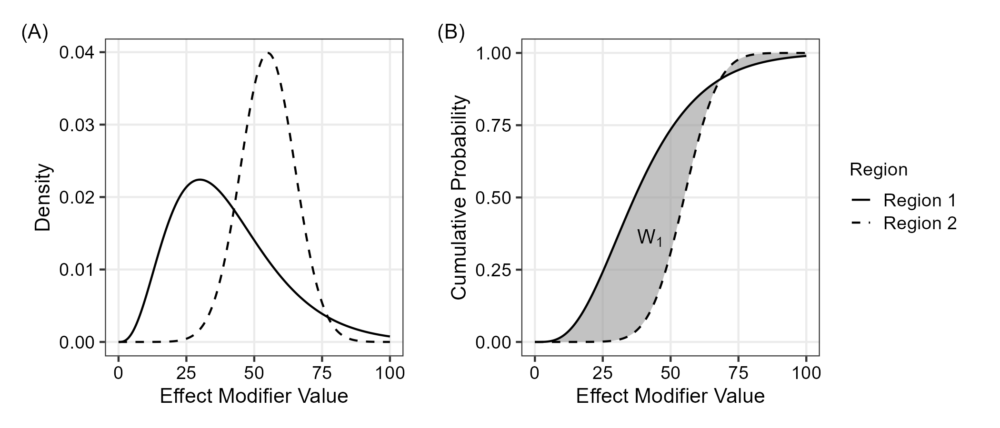
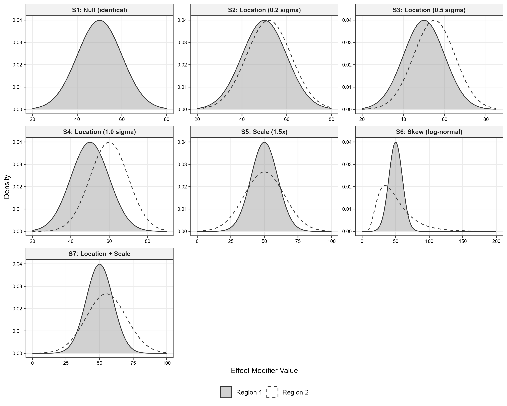
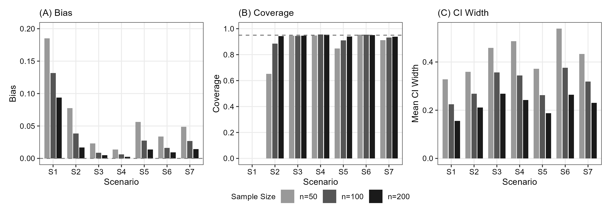
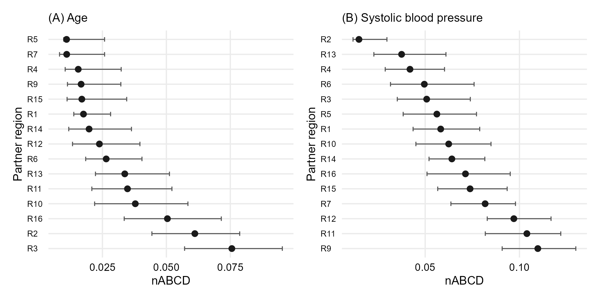

<!-- _class: title -->
<!-- _paginate: false -->

# Effect Modifier の分布類似性に基づく地域プーリングの定量化

##

Tak Nagakubo

---

# Agenda

1. **Background**: MRCT, ICH E17, 既存手法の限界
2. **Methods**: nABCD の定義・理論基盤・推定・clinical calibration
3. **Simulation**: 8シナリオによる推定性能評価
4. **Application**: GUSTO-I を用いた仮想血栓溶解薬 MRCT
5. **Discussion**: 主要な知見と実務への示唆

---

<!-- _class: section -->

# 背景

---

# MRCT と ICH E17

- **MRCT** (Multi-Regional Clinical Trial) は国際共同治験の標準パラダイム
- ICH E17 (2017) は治療効果の一般化可能性を前提とした計画・設計原則を規定
- 各規制当局は **地域部分集団における治療効果の一貫性** を要求

### 地域プーリングの必要性

- 個々の地域サンプルサイズは一貫性評価に不十分なことが多い
- ICH E17 は **effect modifier 分布の類似性** に基づくプーリングを記述
- しかし、定量的方法論は提供されていない

> "Similar enough" の判断基準が欠如している
> --- ICH E17 の実装上のギャップ

---

# Effect Modifier とは

**Effect modifier**: 治療効果がサブグループ間で異なる患者背景因子

### 例: 年齢が effect modifier の場合

- 若年患者の方が治療反応が良い場合、年齢は effect modifier
- 薬が個人レベルで同一に作用しても、患者構成が異なれば地域平均治療効果は異なる

### 地域平均治療効果

$$
\bar{\tau}_r = \int \tau(x) \, dF_r(x)
$$

$\tau(x)$: CATE (条件付き平均治療効果)、$F_r$: 地域 $r$ の effect modifier 分布

---

# 既存手法の限界

| 指標 | 特徴 | 限界 |
|------|------|------|
| **SMD** | スケールフリー、解釈容易 | **位置 (mean) のみ**。分散・形状差を無視 |
| **KS 統計量** | 分布全体を比較 | 臨床的解釈困難。治療効果との理論的連結なし |
| **KL ダイバージェンス** | 密度ベース | 非対称、小サンプルで不安定、$\infty$ に発散可能 |

### SMD の盲点

$$
N(50, 5^2) \text{ vs } N(50, 15^2) \implies \text{SMD} = 0
$$

分散が3倍異なるにもかかわらず SMD は差を検出できない

---

<!-- _class: section -->

# Methods

---

# nABCD の定義

### Wasserstein-1 距離 (Earth Mover's Distance)

$$
W_1(F, G) = \int_{-\infty}^{\infty} |F(x) - G(x)| \, dx
$$

幾何学的解釈: **2つの CDF 間の総面積**

### nABCD: 正規化された CDF 間面積

$$
\text{nABCD}(F_1, F_2) = \frac{W_1(F_1, F_2)}{\text{IQR}_{\text{pooled}}}
$$

- $\text{IQR}_{\text{pooled}}$: プールされた分布の四分位範囲
- 1-IQR の位置シフトで nABCD $= 1.0$ となるよう較正
- **スケールフリー**: 測定単位に依存しない解釈が可能

*Figure: 2つの CDF 間の正規化面積として定義される nABCD*

---

# nABCD の3つの要件充足

### 要件 1: 位置以外の分布特徴

- $W_1$ は位置・分散・歪度の差に反応
- SMD が検出できない分散差・形状差を捕捉

### 要件 2: スケールフリーな解釈

- IQR 正規化により測定単位に依存しない指標
- 推定中心 (estimation-centered): 固定閾値ではなく CI と感度分析で判断

### 要件 3: 理論的連結

- Kantorovich-Rubinstein 双対性により治療効果異質性への上界を提供
- これは $W_1$ 固有の性質 ($W_2$, KS, KL にはない)

---

# 理論基盤: 治療効果異質性との連結

### Kantorovich-Rubinstein 双対性

$$
W_1(F_1, F_2) = \sup_{\|f\|_{\text{Lip}} \leq 1} \left|\int f \, dF_1 - \int f \, dF_2\right|
$$

### Heterogeneity Bound (Proposition 2)

CATE $\tau(x)$ が Lipschitz 定数 $L$ を持つとき:

$$
|\bar{\tau}_1 - \bar{\tau}_2| \leq L \cdot \text{IQR}_{\text{pooled}} \cdot \text{nABCD}(F_1, F_2)
$$

- $L$: effect modifier の1単位変化あたりの治療効果変化の上界
- **分布距離 $\to$ 治療効果差の上界** への定量的橋渡し

---

# 推定と推論

### 推定量

$$
\widehat{\text{nABCD}} = \frac{\sum_{k=1}^{n_1+n_2-1} |\hat{F}_1(x_{(k)}) - \hat{F}_2(x_{(k)})| \cdot (x_{(k+1)} - x_{(k)})}{\widehat{\text{IQR}}_{\text{pooled}}}
$$

### 漸近分布と Bootstrap

- $W_1$ の漸近分布は **非標準**: $\sqrt{n}\,W_1(\hat{F}_n, F) \xrightarrow{d} \int |B(F(x))|\,dx$ (Brownian bridge functional)
- 未知の $F$ に依存 → 普遍的臨界値なし → **percentile bootstrap** を採用 ($B = 2{,}000$)
- $F_1 \neq F_2$ のとき $L_1$ functional の Hadamard 微分が線形 → bootstrap は consistent
- 計算量: $O((n_1+n_2)\log(n_1+n_2))$ --- combined order statistics のソートが支配的

---

# Clinical Calibration: 2つの経路

### 経路 1: $L$ が利用可能な場合 — $\Delta_{\max}$

$$
\Delta_{\max} = L \cdot \text{IQR}_{\text{pooled}} \cdot \text{nABCD}(F_1, F_2)
$$

- 観測された分布差から生じうる **最大治療効果差** を臨床スケールで表現
- $L_{\max}$ (保守的) と $L_{\text{mean}}$ (現実的) の両方を提示

### 経路 2: $L$ が未知の場合 — $L^*$ 逆算

$$
L^* = \frac{\Delta_{\text{clin}}}{\text{IQR}_{\text{pooled}} \cdot \text{nABCD}}
$$

- $\Delta_{\text{clin}}$: 臨床的に重要な治療効果差 (例: 非劣性マージン)
- $L^*$ が臨床的に妥当な範囲を超えていれば、分布差は臨床的に問題になりにくい

---

# MRCT 計画段階の現実: なぜ $L^*$ が主要経路か

### 計画段階で $L$ は通常利用不可

- 発表済みサブグループ解析は **方向と有意性** を報告するが、per-unit slope は通常未報告
- クラス内他剤のメタ解析も、絶対アウトカムスケール上の per-year / per-mmHg 勾配を明示しないことが多い
- 数値的 prior として使える情報が存在しないケースが典型的

### $L^*$ 逆算の位置づけ

- 計画段階の **主要な calibration ツール**
- 観測された nABCD が臨床的に意味を持つために必要な CATE 感度 $L^*$ を算出
- Sponsor は $L^*$ が分野知識に照らして妥当か判断
- $L$ が後に判明した場合に $\Delta_{\max}$ 経路で補完可能

---

# 推定中心の設計思想

### 固定閾値を置かない

- nABCD 値そのものに「poolable / not poolable」の二値判定を割り当てない
- ICH E17 の "similar enough" は **本質的に文脈依存**
- 同じ nABCD でも partner と effect modifier ごとに $L^*$ が異なる → 普遍的カットオフは避ける

### 枠組みが提供するもの

- **nABCD 点推定値 + bootstrap CI** — 分布距離の不確実性
- **$L^*$ 逆算値** (または $\Delta_{\max}$ + CI) — 臨床スケールでの感度
- これらを並置して報告し、sponsor + 臨床・規制 advisor が判断

> 枠組みは **定量的インプット** を提供する。判断は sponsor が行う。

---

<!-- _class: section -->

# Simulation

---

# シミュレーション設計

### 7つのシナリオ

| ID | 説明 | Distribution 1 | Distribution 2 | True nABCD |
|----|------|----------------|----------------|------------|
| S1 | Null (同一) | $N(50, 10^2)$ | $N(50, 10^2)$ | 0.000 |
| S2 | 位置 0.2$\sigma$ | $N(50, 10^2)$ | $N(52, 10^2)$ | 0.073 |
| S3 | 位置 0.5$\sigma$ | $N(50, 10^2)$ | $N(55, 10^2)$ | 0.180 |
| S4 | 位置 1.0$\sigma$ | $N(50, 10^2)$ | $N(60, 10^2)$ | 0.328 |
| S5 | 尺度 1.5x | $N(50, 10^2)$ | $N(50, 15^2)$ | 0.122 |
| S6 | 歪度 (Log-normal $\sigma_{\ln}=0.5$) | $N(50, 10^2)$ | LogN | 0.304 |
| S7 | 位置+尺度 | $N(50, 10^2)$ | $N(55, 15^2)$ | 0.175 |

$n = 50, 100, 200$ / 地域、10,000反復、$B = 2{,}000$ bootstrap resamples

*Figure: シナリオ S1--S7 の分布対の overview*

---

# シミュレーション結果: バイアスと被覆確率

### バイアス ($n = 100$)

- True nABCD $\geq 0.1$ のシナリオ: バイアス $< 0.02$
- S3 (0.5$\sigma$): +0.003、S4 (1.0$\sigma$): +0.003 --- ほぼ無視可能
- 近境界シナリオ (S1): 正のバイアスが大きい (非負制約による)

### 被覆確率 (95% CI, $n = 100$)

| シナリオ | $n = 50$ | $n = 100$ | $n = 200$ |
|---------|---------|----------|----------|
| S3 (0.5$\sigma$) | 0.947 | 0.951 | 0.947 |
| S4 (1.0$\sigma$) | 0.950 | 0.950 | 0.957 |
| S6 (Skew) | 0.953 | 0.954 | 0.954 |
| S7 (Loc+Scale) | 0.917 | 0.935 | 0.944 |

**推奨**: $n \geq 100$ / 地域で信頼性のある推定・推論が可能

*Figure: バイアス (A)、被覆確率 (B)、CI 幅 (C) — シナリオ S1--S7、$n = 50, 100, 200$*

---

# nABCD vs SMD: 感度比較 ($n = 100$)

| シナリオ | nABCD (mean $\pm$ SD) | SMD (mean $\pm$ SD) | 含意 |
|---------|----------------------|--------------------|----|
| S3 (位置) | $0.183 \pm 0.048$ | $0.50 \pm 0.14$ | 両方が検出 |
| S5 (尺度のみ) | $0.136 \pm 0.033$ | $0.00 \pm 0.14$ | **nABCD のみ検出** |
| S6 (歪度のみ) | $0.312 \pm 0.048$ | $0.00 \pm 0.14$ | **nABCD のみ検出** |

### Key Finding

- 位置差: SMD と nABCD は同等の情報を提供
- **尺度・歪度差**: SMD はゼロのまま --- nABCD のみが検出
- S6 は特に顕著: 大きな分布差 (nABCD $= 0.31$) が SMD には完全に不可視

---

<!-- _class: section -->

# Application

---

# 適用例: GUSTO-I を用いた仮想 MRCT 計画

### 設定

- 新規血栓溶解薬 **Drug T** の急性心筋梗塞 (AMI) Phase 3 MRCT を計画
- GUSTO-I (公開データ; $N = 40{,}830$、16 anonymized regions) を分布情報源として利用
- GUSTO-I 自体は MRCT ではなく、regions は anonymize 済み → 地理解釈は不可
- あくまで **方法論デモンストレーション** としての利用

### Anchor region

- **Region 8** ($n = 2{,}916$) を anchor として設定
- 想定: 地域特異的な有効性エビデンスが要求されるが、サンプルサイズが限定的な市場
- 残り 15 partner regions との分布類似性を評価し、プーリング候補を同定

---

# 候補 Effect Modifier の選定と $L$ の状況

### 2つの **候補 effect modifier**

- **Age** (年齢): 生物学的妥当性とクラスエビデンスから候補
- **SBP** (収縮期血圧): 同様に候補

### $L$ は両方とも a priori に数値未知

- **Age**: FTT collaborative meta-analysis (1994) は "irrespective of age" としか述べず、per-year CATE slope は未報告
- **SBP**: クラスレベルの定量的 CATE 感度推定は存在しない
- 両変数とも **$L^*$ 逆算経路** を適用

### Region 8 ベースライン

| 候補 effect modifier | Mean | SD | Skewness | IQR$_{\text{pooled}}$ |
|---------------------|------|-----|----------|----------------------|
| Age (years) | 60.2 | 12.1 | $-0.17$ | 17--18 |
| SBP (mmHg) | 132.4 | 22.9 | 0.20 | 30--34 |

---

# nABCD 結果: Region 8 vs 15 partners (Age)

### Age nABCD のレンジ

- 点推定値: **0.011 (R5, R7) -- 0.076 (R3)** — 狭いレンジ
- 15 partners のうち 11 が $< 0.040$

| Rank | Partner | $n$ | nABCD$_{\text{age}}$ [95% CI] |
|------|---------|-----|-------------------------------|
| 1 | R5 | 1909 | 0.011 [0.010, 0.026] |
| 2 | R7 | 3150 | 0.011 [0.008, 0.026] |
| 3 | R4 | 2876 | 0.016 [0.010, 0.032] |
| 4 | R9 | 3123 | 0.017 [0.011, 0.032] |
| ... | ... | ... | ... |
| 14 | R2 | 2952 | 0.061 [0.044, 0.079] |
| 15 | R3 | 2030 | 0.076 [0.057, 0.095] |

Percentile bootstrap, $B = 2{,}000$

*Figure: Age nABCD forest plot --- Region 8 vs 15 partners (95% bootstrap CI)*

---

# nABCD 結果: SBP

### SBP nABCD のレンジ

- 点推定値: **0.015 (R2) -- 0.110 (R9)** — Age より広いレンジ
- 多くの partner は 0.050--0.110 区間に集中

### Age と SBP でランキングが異なる

- GUSTO-I データにおいて **SBP の地域間異質性は age より大きい**
- 単一の effect modifier だけでランキングすると結論が変わる

### Bootstrap CI の役割

- mid-rank 付近では CI が overlap → ランキングの確度に不確実性
- 例: R16 (age 13位, nABCD 0.050, CI [0.034, 0.071]) は上位複数 partners とオーバーラップ
- **CI 幅を併記することで「どの程度自信を持って順位を示せるか」を伝達**

---

# R2 vs R9: なぜ両変数を同時に評価すべきか

### 対照的なパターン

| | R2 | R9 |
|---|----|----|
| nABCD$_{\text{age}}$ | **0.061** (2番目に大) | 0.017 (4番目に小) |
| nABCD$_{\text{SBP}}$ | **0.015** (最小) | **0.110** (最大) |

### 含意

- 単一 effect modifier のランキングでは **逆の結論** に至る
- R2: SBP で最良だが age で最悪近く
- R9: age で良好だが SBP で最悪
- **両候補 effect modifier を joint に評価することが必須**

---

# 主候補: R4 (6 partners jointly eligible)

### $L$ の臨床的妥当上限 (illustrative bounds)

- $L_{\text{age,UB}} = 1\times10^{-2}$ /yr; $L_{\text{SBP,UB}} = 2\times10^{-3}$ /mmHg (クラスエビデンス: GUSTO-I, FTT 1994)
- ある effect modifier で **eligible** = $L^* > L_{\text{UB}}$

### Joint Eligibility (両 EM で eligible)

- **6 partners が両 EM で eligible**: **R1, R4, R5, R6, R14, R15**
- **R4** が **主単一プール候補** — age 3位 (0.016)、SBP 4位 (0.042)、両 modifier で balanced
- R5 は age で最低 nABCD (0.011) だが SBP は 6位 — asymmetric profile

> 定量的 input、最終判断は clinical / regulatory advisor と協議

---

# 枠組みの哲学: 判断は sponsor が行う

### 枠組みが **しない** こと

- 二値の "poolable / not poolable" 指定を与えない
- nABCD 値に固定カットオフを設けない
- Sponsor の判断を代替しない

### 枠組みが **提供する** もの

- nABCD 点推定値 + bootstrap 95% CI
- $L^*$ 感度 (必要な CATE 感度)
- 複数候補 effect modifier の joint 評価 (scatter, forest)

### 判断主体

- Sponsor が clinical advisor、regulatory advisor と協議のうえ判断
- 追加 partner を検討する場合も、各 partner の $L^*$ と CI 幅を精査すれば評価可能

---

<!-- _class: section -->

# Discussion

---

# 主要な知見のサマリー

### Simulation

- 中規模サンプル + non-negligible 分布差で **percentile bootstrap は信頼できる**
- Null 近傍・境界では正のバイアスとゼロ被覆 → reliable inference の下限を画定

### GUSTO-I Application

- Age と SBP で partner ranking が大きく異なる
- 一方の候補で類似でも、もう一方では非類似なケースあり
- **6 partners** (R1, R4, R5, R6, R14, R15) が両 EM で eligible、**R4** が主単一プール候補として浮上

---

# Interpretation: 2つの実務的含意

### 含意 1: 全候補 effect modifier を同時に評価

- 単一候補だけでランキングすると **R2 vs R9 の対比** のような逆転が起きうる
- 省略された候補の分布差が後段で consistency を毀損するリスク
- 候補の subset に絞らず、**全候補を joint に評価**

### 含意 2: nABCD ランキング単独では partner 選定不能

- 同じ nABCD でも partner / candidate ごとに $L^*$ が大きく変動
- 6 partners (R1, R4, R5, R6, R14, R15) が両 EM で eligible、R4 が両 modifier で balanced ranking で主候補として浮上
- **分布距離ランキング + 臨床 calibration** の両方が必要

---

# Strengths: Dual-Pathway Calibration

### Strength 1: Adaptation to evidence state

- $L$ 既知 (confirmatory): $\Delta_{\max}$ で worst-case を臨床スケールで報告
- $L$ 未知 (planning): $L^*$ 逆算で必要感度を算出し分野知識と対照
- **固定 nABCD カットオフを課さず**、エビデンス状況に応じて経路を選択

### Strength 2: Distributional value is invariant

- nABCD 自体は **scale + skewness の差** を SMD と独立に捕捉
- $L$ の有無に依存せず distributional measure としての価値を保つ
- Clinical calibration は分布評価を **強化**するもので、置換するものではない

---

# 実務への推奨

1. 候補 effect modifier ごとに **nABCD + bootstrap CI** を算出 ($n \geq 100$/地域)

2. $L$ が推定可能な場合: **$\Delta_{\max}$** とその CI を臨床スケールで報告

3. $L$ が未知の場合 (計画段階の典型): **$L^*$ を pre-specified $\Delta_{\text{clin}}$ で算出** → 分野知識と対照

4. $\Delta_{\max}$ または $L^*$ を全体治療効果・非劣性マージンと **並置して** 報告

5. 複数候補がある場合: 最大 $\Delta_{\max}$ (最小 $L^*$) による保守判断、
   または totality-of-evidence アプローチ

> 固定閾値ではなく、**文脈依存の sponsor 判断** を支援する

---

# 政策と限界

### Policy: 多様なデータソースとの互換性

- nABCD はベースライン分布のみで計算可能 → prior trials / registries / EHR / RWE
- ICH E6(R3) の RWE 推進と整合
- PMDA workshop (Matsushima et al. 2024) で示された地域不均衡の事前評価が可能

### 主な限界

- 連続 effect modifier のみ — 離散 EM は将来課題
- 各 EM を個別評価 — 多変量拡張は研究課題
- True nABCD $\lesssim 0.05$ の境界域では正バイアス・低被覆
- $L$ の transfer assumption (clinical judgment + 感度分析が必要)

---

# Future Work と結語

### Future Work

- **Categorical effect modifiers** への拡張
- 関連する baseline characteristic を **どう effect modifier として同定するか** という上流課題
- 多変量拡張、small-sample bias correction

### 本研究の本質的貢献

$$
\boxed{|\bar{\tau}_1 - \bar{\tau}_2| \leq L \cdot \text{IQR}_{\text{pooled}} \cdot \text{nABCD}}
$$

- これまで **qualitative judgment** に留まっていた "similar enough" を、
- **再現可能な quantitative basis** に変換
- ICH E17 実装ギャップを埋め、evidence-based pooling 判断を支援

---

<!-- _class: end -->
<!-- _paginate: false -->

# Thank You

ご質問をお願いします

Tak Nagakubo
