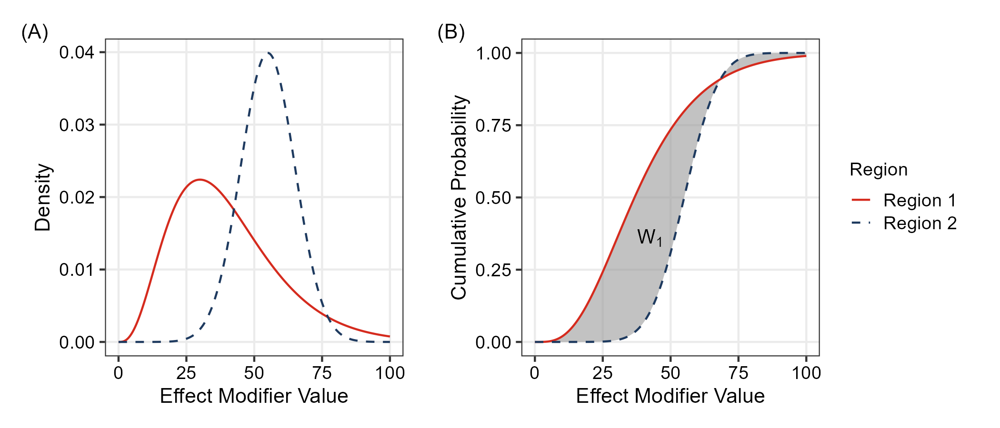
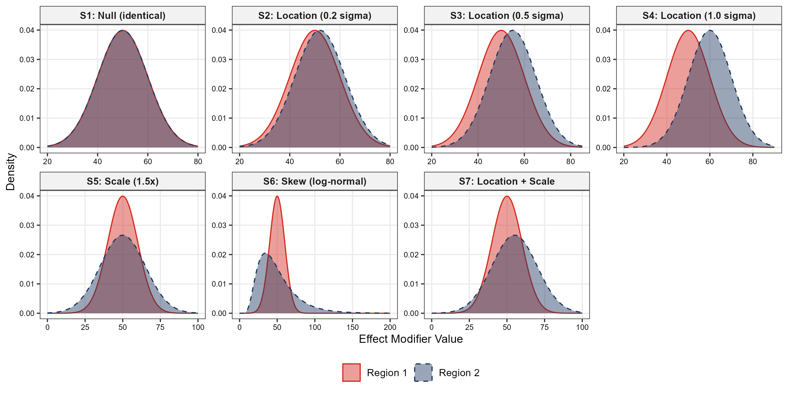
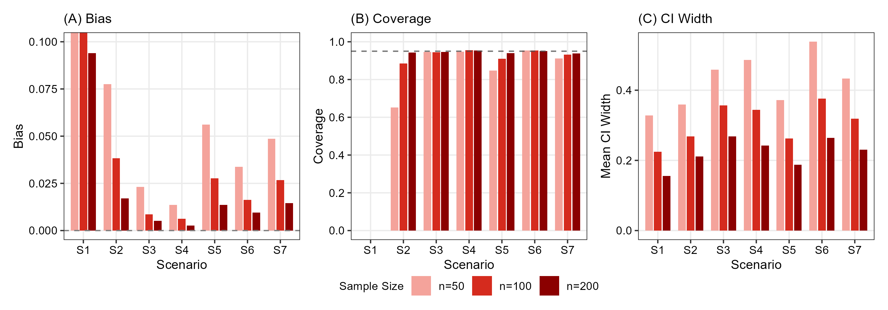
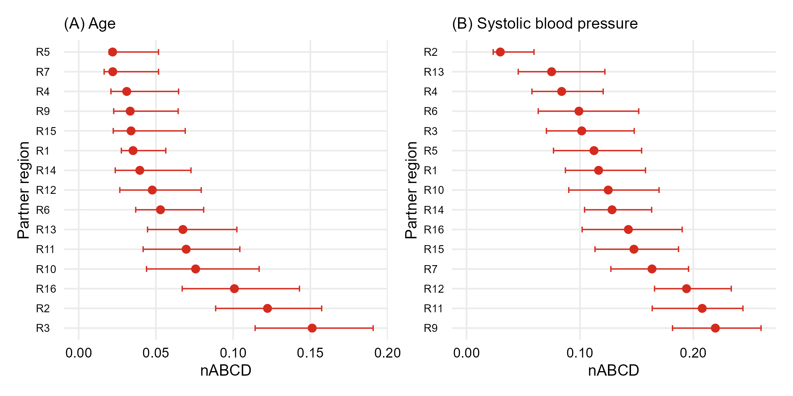

<!-- _class: title -->
<!-- _paginate: false -->

# Quantifying Effect Modifier Similarity for Regional Pooling in Multi-Regional Clinical Trials

##

Tak Nagakubo

---

# Agenda

1. **Introduction**: Regional pooling, methodological gap, and our aim
2. **Methods**: nABCD definition, theoretical foundation, and clinical calibration
3. **Simulation**: Estimation performance across 7 scenarios
4. **Application**: Hypothetical thrombolytic MRCT using GUSTO-I
5. **Discussion**: Key findings and practical recommendations

---

<!-- _class: section -->

# Introduction

---

# Regional Pooling: A Practical Challenge

### Why pooling is needed

- MRCTs assess treatment effect consistency across regions
- Individual regional sample sizes are often too small alone
- ICH E17 strategy: pool regions with similar **effect modifier** distributions
  (effect modifier = baseline characteristic for which treatment benefit differs across subgroups)
- This paper focuses on **continuous effect modifiers** (e.g., age, baseline severity, laboratory values)

### The challenge for sponsors

- At the **planning stage**, sponsors must select pooling partners with evidence that two regions are "similar enough"

Cautionary example: Secukinumab MRCT (Matsushima 2024)

Unassessed regional imbalance in CRP+/MRI- status → apparent treatment effect inconsistency at analysis.

---

# Methodological Gap and Research Objectives

### The gap

- ICH E17 provides no specific metric, threshold, or procedure for "similar enough"
- The standard tool for **continuous covariates** is the Standardized Mean Difference (SMD), which is **blind** to differences in variance and shape
- → No quantitative evidence base for partner selection

### Objectives

- Develop a quantitative index that captures distributional similarity beyond means
- Deliver a practitioner-facing tool for the **planning stage** of an MRCT

---

<!-- _class: section -->

# Methods

---

# Existing Approaches and Their Limitations

SMD — blind to variance and shape

Mean difference / pooled SD. $N(50, 5^2)$ vs $N(50, 15^2)$ → SMD = 0 despite a 3× difference in spread.

Kolmogorov–Smirnov — no link to treatment effects

$\sup_x |F_1(x) - F_2(x)|$ captures full shape, but no theoretical bridge to clinical scale.

KL divergence — asymmetric, can diverge

$\int p \log(p/q)\,dx$ requires density estimation; diverges with non-overlapping supports.

### Three requirements

1. **Beyond location** (variance, shape)
2. **Clinically interpretable scale**
3. **Theoretical link to treatment effect heterogeneity**

---

# Defining nABCD: Wasserstein-1 over IQR

Wasserstein-1 distance

The total area between two CDFs — captures differences in **location, variance, and shape**.

$$
W_1(F, G) = \int |F(x) - G(x)| \, dx
$$

nABCD: scale-free dissimilarity

Normalized by the pooled IQR — a one-IQR location shift yields nABCD = 1.0.

$$
\text{nABCD}(F_1, F_2) = \frac{W_1(F_1, F_2)}{\text{IQR}_{\text{pooled}}}
$$

---

# Theoretical Foundation: Heterogeneity Bound

### Kantorovich-Rubinstein Duality

$$
W_1(F_1, F_2) = \sup_{\|f\|_{\text{Lip}} \leq 1} \left|\int f \, dF_1 - \int f \, dF_2\right|
$$

Heterogeneity Bound (Proposition 2)

If the CATE $\tau(x)$ is Lipschitz continuous with constant $L$:

$$
|\bar{\tau}_1 - \bar{\tau}_2| \leq L \cdot \text{IQR}_{\text{pooled}} \cdot \text{nABCD}(F_1, F_2)
$$

- $L$: upper bound on treatment effect change per unit change in the effect modifier
- **A quantitative bridge from distributional distance to treatment effect differences**

---

# Estimation

### Empirical estimator

$$
\widehat{\text{nABCD}} = \frac{\sum_{k=1}^{n_1+n_2-1} |\hat{F}_1(x_{(k)}) - \hat{F}_2(x_{(k)})| \cdot (x_{(k+1)} - x_{(k)})}{\widehat{\text{IQR}}_{\text{pooled}}}
$$

- Computation: $O((n_1+n_2) \log(n_1+n_2))$ — sort dominates

### Inference: Percentile bootstrap

- Asymptotic distribution non-standard: $\sqrt{n}\, W_1(\hat{F}_n, F) \xrightarrow{d} \int |B(F)|\, dx$ — Brownian bridge (del Barrio 1999)
- No universal critical values → **percentile bootstrap** ($B = 2{,}000$ resamples)
- Consistent for $F_1 \neq F_2$ via Hadamard derivative linearity (Sommerfeld 2018)
- Convergence rate $\sqrt{n_1 n_2 / (n_1 + n_2)}$
- Boundary case $F_1 = F_2$: parameter space edge — addressed in simulation

---

# Clinical Calibration: Two Pathways

Pathway 1: When L is available — Δmax

$$
\Delta_{\max} = L \cdot \text{IQR}_{\text{pooled}} \cdot \text{nABCD}(F_1, F_2)
$$

- Worst-case regional treatment effect difference on the **clinical scale**
- Confirmatory or post-hoc evaluation when $L$ is estimable

Pathway 2: When L is unknown — L* reverse calculation

$$
L^* = \frac{\Delta_{\text{clin}}}{\text{IQR}_{\text{pooled}} \cdot \text{nABCD}}
$$

- $\Delta_{\text{clin}}$: clinically important difference (e.g., NI margin)
- $L^*$ above plausible range: distributional difference unlikely to be clinically concerning
- **Primary calibration tool at the planning stage**, where $L$ is typically unavailable

### Estimation-Centered Design

- No fixed nABCD cutoff
- Quantitative inputs (point estimate + bootstrap CI + $L^*$) support sponsor judgment

---

<!-- _class: section -->

# Simulation

---

# Simulation Design: Seven Scenarios

| ID | Description | Distribution 1 | Distribution 2 | True nABCD |
|----|-------------|-----------------|-----------------|------------|
| S1 | Null (identical) | $N(50, 10^2)$ | $N(50, 10^2)$ | 0.000 |
| S2 | Location 0.2$\sigma$ | $N(50, 10^2)$ | $N(52, 10^2)$ | 0.146 |
| S3 | Location 0.5$\sigma$ | $N(50, 10^2)$ | $N(55, 10^2)$ | 0.358 |
| S4 | Location 1.0$\sigma$ | $N(50, 10^2)$ | $N(60, 10^2)$ | 0.656 |
| S5 | Scale 1.5x | $N(50, 10^2)$ | $N(50, 15^2)$ | 0.244 |
| S6 | Skew (Log-normal) | $N(50, 10^2)$ | LogN | 0.606 |
| S7 | Location + Scale | $N(50, 10^2)$ | $N(55, 15^2)$ | 0.347 |

$n = 50, 100, 200$ per region; 10,000 replications; $B = 2{,}000$ bootstrap resamples

---

# Simulation Design: Scenario Overview

*Distribution pairs for scenarios S1--S7 — covering null, pure location shifts, scale-only, skewness, and combined location+scale differences*

---

# Simulation Results: Bias and Coverage

### Bias ($n = 100$)

- True nABCD $\geq 0.1$: bias $< 0.02$ (S3, S4: +0.003 — negligible)
- Near-boundary (S1): larger positive bias from non-negativity constraint

### Coverage Probability (95% CI)

| Scenario | $n = 50$ | $n = 100$ | $n = 200$ |
|----------|----------|-----------|-----------|
| S3 (0.5$\sigma$) | 0.947 | 0.951 | 0.947 |
| S4 (1.0$\sigma$) | 0.950 | 0.950 | 0.957 |
| S6 (Skew) | 0.953 | 0.954 | 0.954 |
| S7 (Loc+Scale) | 0.917 | 0.935 | 0.944 |

**Recommendation**: $n \geq 100$ per region for reliable estimation and inference

---

# Estimation Properties: Visual Summary

*Bias (A), coverage (B), and CI width (C) across scenarios S1--S7 and sample sizes $n = 50, 100, 200$*

---

# nABCD vs SMD: Sensitivity ($n = 100$)

| Scenario | nABCD (mean $\pm$ SD) | SMD (mean $\pm$ SD) | Implication |
|----------|----------------------|--------------------|----|
| S3 (Location) | $0.366 \pm 0.096$ | $0.50 \pm 0.14$ | Both detect |
| S5 (Scale only) | $0.272 \pm 0.066$ | $0.00 \pm 0.14$ | **Only nABCD detects** |
| S6 (Skew only) | $0.624 \pm 0.096$ | $0.00 \pm 0.14$ | **Only nABCD detects** |

### Key Finding

- Location shift: SMD and nABCD provide equivalent information
- **Scale and skewness**: SMD remains at zero --- only nABCD detects
- S6 is particularly striking: a large distributional difference (nABCD $= 0.62$) is entirely invisible to SMD

---

<!-- _class: section -->

# Application

---

# Application: Thrombolytic MRCT (GUSTO-I)

### Setting

- Phase 3 MRCT for a novel thrombolytic agent (Drug T) in AMI
- GUSTO-I (public IPD; $N = 40{,}830$, 16 anonymized regions) used as a distributional source
- GUSTO-I is not an MRCT and regions are anonymized — methodological illustration only

### Anchor Region

- **Region 8** ($n = 2{,}916$) designated as the small-sample anchor
- Remaining 15 partner regions evaluated as pooling candidates

### Two Candidate Effect Modifiers

- **Age** and **SBP** (systolic blood pressure)
- Per-unit CATE slope ($L$) unavailable a priori for either
  - Age: FTT meta-analysis (1994) reports only "irrespective of age"
  - SBP: no quantitative class-level CATE sensitivity
- **$L^*$ reverse calculation** applied for both

---

# nABCD Results: R8 vs Partners

### Age nABCD

- Range: **0.022 (R5, R7) -- 0.151 (R3)** — narrow; 11 of 15 partners $< 0.080$

### SBP nABCD

- Range: **0.030 (R2) -- 0.219 (R9)** — wider; most cluster in 0.100--0.220

### Bootstrap CIs

- Mid-rank CIs overlap → varying ranking confidence; widths reported alongside point estimates

---

# Region 8 vs Partners: Forest Plot

*Forest plots of nABCD with 95% bootstrap CIs — age (A) and SBP (B)*

---

# R2 vs R9: Why Evaluate Jointly

| | R2 | R9 |
|---|----|----|
| nABCD$_{\text{age}}$ | **0.122** (2nd largest) | 0.033 (4th smallest) |
| nABCD$_{\text{SBP}}$ | **0.030** (smallest) | **0.219** (largest) |

### Implication

- A single effect modifier → **opposite conclusions**; R2 best on SBP, near-worst on Age; R9 good on Age, worst on SBP
- **Evaluate all candidate effect modifiers jointly**

---

# Leading Candidate: R4 (Six Eligible)

### Plausible Upper Bounds for $L$

- $L_{\text{age,UB}} = 1\times10^{-2}$ /yr; $L_{\text{SBP,UB}} = 2\times10^{-3}$ /mmHg (class-level evidence; GUSTO-I, FTT 1994)
- A partner is **eligible** on a modifier if $L^* > L_{\text{UB}}$

### Joint Eligibility

- **Six partners jointly eligible** on both modifiers: **R1, R4, R5, R6, R14, R15**
- **R4** is the **leading single-pool candidate** — 3rd-lowest age (0.031) and 4th-lowest SBP (0.084); balanced across both modifiers
- R5 has lowest age nABCD (0.022) but only 6th-lowest on SBP — asymmetric profile

> Quantitative inputs; final judgment with clinical/regulatory advisors

---

<!-- _class: section -->

# Discussion

---

# Summary of Findings

### Simulation

- Percentile bootstrap is **reliable** at moderate sample sizes for non-negligible distributional differences
- Positive bias and zero coverage at the null / near-boundary define the **lower limit of reliable inference**

### GUSTO-I Application

- Two candidate effect modifiers (Age, SBP) produced **markedly different partner rankings**
- Some partners ranked similar on one but dissimilar on the other
- **Six partners** (R1, R4, R5, R6, R14, R15) emerged as **jointly eligible**; **R4** is the leading single-pool candidate

---

# Interpretation: Two Implications

### Implication 1: Evaluate all candidate effect modifiers jointly

- R2 vs R9 contrast: a partner similar on one modifier may not be on another
- Restricting to a subset risks omitting modifiers that later compromise consistency

### Implication 2: Partner selection cannot rest on nABCD alone

- $L^*$ varies markedly across partners and modifiers
- Same nABCD carries different clinical weight depending on partner-specific differences
- Six partners (R1, R4, R5, R6, R14, R15) emerged as **jointly eligible**; **R4** stood out as leading single-pool candidate due to balanced ranking on both modifiers

> Pooling judgments require **distributional ranking + clinical calibration** across all candidates

---

# Strengths: Dual-Pathway Calibration

### Strength 1: Adapts to the evidence state

- Planning stage with $L$ unknown: $L^*$ reverse-calculation as primary calibration
- Confirmatory stage with $L$ available: $\Delta_{\max}$ provides complementary clinical-scale calibration
- No fixed nABCD cutoff imposed

### Strength 2: Distributional value is invariant

- nABCD captures **scale and skewness** differences invisible to SMD
- This property holds **regardless of whether $L$ is available**
- Clinical calibration **enhances**, not replaces, the distributional assessment

---

# Practical Recommendations

1. Compute **nABCD + bootstrap CI** for every candidate effect modifier ($n \geq 100$ per region)

2. When $L$ is estimable: translate to **$\Delta_{\max}$** with bootstrap CI

3. When $L$ is unknown: compute **$L^*$** at pre-specified $\Delta_{\text{clin}}$ values

4. Report alongside **overall treatment effect and non-inferiority margin** to support deliberation

5. Multiple effect modifiers: conservative (maximum $\Delta_{\max}$, smallest $L^*$) or totality-of-evidence approach

### Policy Advantage

- nABCD requires only baseline distributions → applicable to **trials, registries, EHR, RWE**
- Aligns with ICH E6(R3) RWE promotion

---

# Future Work and Closing

### Future Work

- Extension to **categorical effect modifiers**
- Upstream identification of which baseline characteristics constitute relevant effect modifiers — a non-trivial problem deserving dedicated investigation
- Multivariate extensions and small-sample bias correction

### The Principal Contribution

$$
\boxed{|\bar{\tau}_1 - \bar{\tau}_2| \leq L \cdot \text{IQR}_{\text{pooled}} \cdot \text{nABCD}}
$$

- nABCD + bootstrap CI + clinical calibration ($\Delta_{\max}$ or $L^*$)
- Transforms the **previously qualitative** judgment of "similar enough"
- Into a **reproducible quantitative basis** for sponsor judgment
- Filling the methodological gap left by ICH E17

---

<!-- _class: end -->
<!-- _paginate: false -->

# Thank You

Questions welcome

Tak Nagakubo
